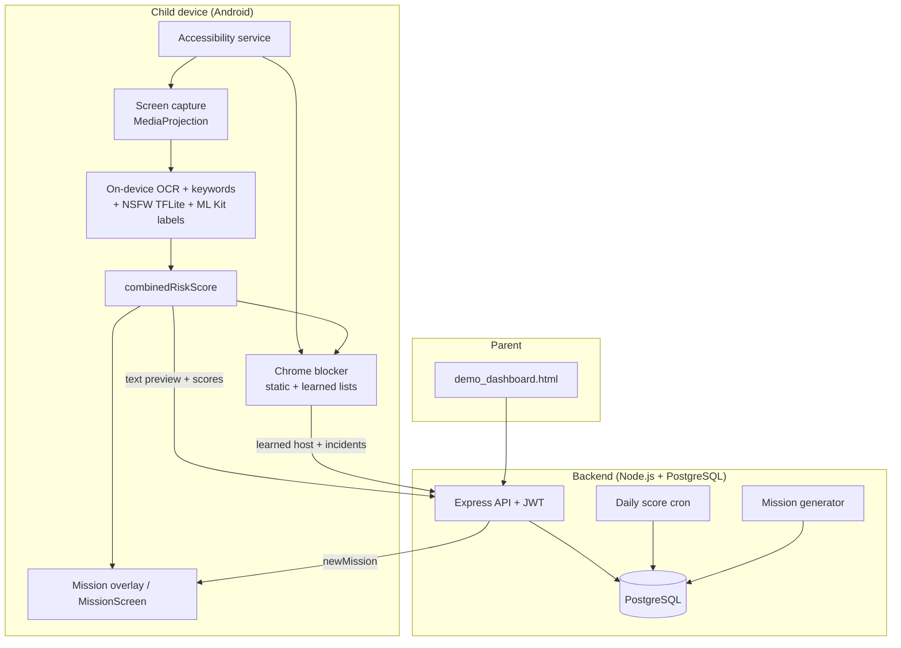

# SafeGuard — AI Parental Control Platform (PFE)

**Student:** Helmi Megdiche – ESPRIT (5th year)  
**Internship period:** 01/02/2026 – 31/07/2026  
**Repository:** [github.com/Helmi-Megdiche/PFE_optimization](https://github.com/Helmi-Megdiche/PFE_optimization)  
**Version:** Current `main` (post-Phase B, September 2026). v1.0-final (5 June 2026, `59da85b`) was the pre-Phase-B release.

---

## Table of Contents

- [What SafeGuard does](#what-safeguard-does)
- [Privacy model](#privacy-model)
- [Architecture at a glance](#architecture-at-a-glance)
- [Features](#features)
  - [Screen analysis and risk](#screen-analysis-and-risk)
  - [Adaptive capture](#adaptive-capture)
  - [Missions and games](#missions-and-games)
  - [Adult-site blocking in Chrome](#adult-site-blocking-in-chrome)
  - [Parent dashboard](#parent-dashboard)
- [Tech stack](#tech-stack)
- [Repository structure](#repository-structure)
- [Getting started](#getting-started)
- [Running the tests](#running-the-tests)
- [Troubleshooting](#troubleshooting)
- [Known limitations / future work](#known-limitations--future-work)
- [Documentation](#documentation)
- [License](#license)

---

## What SafeGuard does

Classic parental-control apps restrict (block apps, limit screen time) without understanding what the child is doing. SafeGuard adds a layer of behavioural intelligence on an Android child device:

- **Screen content analysis on the device** — on-device OCR (English, French, Arabic, Tunisian Derja/Arabizi), a multilingual keyword filter and an on-device image model detect adult, violent, toxic and dangerous content **without any screenshot leaving the phone**.
- **Adult-site blocking in Chrome** — an Accessibility service blocks known adult domains and learns new ones from what the image model sees.
- **Usage-based scores** — a daily addiction-risk score and a daily digital well-being score.
- **Gamified missions** — risky content or unhealthy usage triggers age-adapted missions (quizzes, games, real-world activities). Points, badges and parent-defined rewards follow.
- **Parent dashboard** — a web page for monitoring, mission approval, rewards, interests and blocked-site history.

The child app is **Android-only** (React Native), with a Node.js + PostgreSQL backend.

---

## Privacy model

No image or screenshot is ever uploaded. Release builds delete the screenshot file right after processing. Debug builds keep it in the app's private storage on the device for inspection. In both, no image or screenshot is ever uploaded.

What the backend receives is exactly:

| Data | Where it comes from |
|------|---------------------|
| Text preview (≤ 500 chars) | OCR of the screen |
| Scores and categories | On-device risk scoring (numeric scores, an enum category, app package/label, and a schema-bounded classifier-details object with every string length-capped and unknown keys stripped) |
| The host of a learned adult domain | Chrome address bar, host only |
| Browser block incidents | Host, list source (`static` / `detected`), time |

- The address-bar read keeps only the host; the full URL and path are never stored or sent.
- The text preview (≤500 chars) is OCR of whatever is visible on screen, so it can include any text shown there, including a web address. That preview is what reaches the backend.
- In all builds, the first 80 characters of the preview are also written to the device's local log (logcat). It stays on the phone and other apps can't read it.

Every field is validated server-side (`backend/src/validators/`). Monitoring starts only after the MediaProjection consent dialog. The design follows GDPR / COPPA data-minimisation principles. The server-side debug tools (`/api/debug/*`, used only by the dashboard's debug panels to validate OCR and classification) accept uploaded images and are not mounted in production.

---

## Architecture at a glance



Full component, data, runtime and deployment views: [docs/architecture.md](docs/architecture.md).

---

## Features

### Screen analysis and risk

Each processed frame runs ML Kit OCR (with an Arabic Tesseract fallback), a UI-noise filter, Arabizi normalization and the EN/FR/AR/Derja keyword filter, plus Yahoo Open NSFW (`nsfw.tflite`, 224×224) and ML Kit image labels. They combine as:

```
combinedRiskScore = OCR × 0.3 + vision × 0.7      (MobileApp/src/utils/riskCombination.ts)
```

Context rules then correct known false positives (filtered search pages, social inboxes, launcher thumbnails). Formulas: [docs/scoring_formulas.md](docs/scoring_formulas.md). OCR layers and vision detail: [architecture §7](docs/architecture.md#7-on-device-ai-pipeline).

### Adaptive capture

Capture is triggered by app switches (from the Accessibility service, or a 1 s UsageStats poll as fallback), a follow-up 5 s later, scroll settling, and a periodic re-scan whose interval follows recent risk: **10 s** (average > 70), **15 s** (30–70), **20 s** (< 30), adjusted by app category (browsers/social ≤ 15 s, games off, education ≥ 120 s). One native 5 s tick drives the periodic path; a 5 s debounce bounds load. Detail, including wedged-frame recovery and every timer: [architecture §7.3](docs/architecture.md#73-adaptive-capture), [§8.5](docs/architecture.md#85-timers-reference) and [§10.1](docs/architecture.md#101-wedged-frame-recovery).

### Missions and games

A risky capture creates a mission when `combinedRiskScore` exceeds an adaptive threshold (7-day average + 10, clamped 50–80), or when the last 5 events in 30 min sum to more than 300 (at least 3 events). The daily cron also creates missions for low well-being (< 40) or high addiction (> 70). A new risky-content mission is blocked while a **pending** risky mission exists or one was **escaped/abandoned (failed)** within `MISSION_RISK_COOLDOWN_MINUTES` (15 min; 2 min in development); a further risky capture re-surfaces the existing mission instead.

There are **6 playable games**. Quiz and Tic-Tac-Toe play inside the overlay, and real-world missions are confirmed there; Sudoku, N-back, Reaction and Tower of Hanoi open in the app. N-back is not in the adult or violent mission pools; it stays in the high-addiction pool. Quiz questions come from the database (22 questions: safety 5, conflict 5, empathy 4, media_violence 8). A Tic-Tac-Toe result is accepted only after the server replays the submitted moves. Rules, pools, completion payloads, badges and timers: [architecture §8](docs/architecture.md#8-backend-internals).

### Adult-site blocking in Chrome

With the SafeGuard Accessibility service enabled, the app reads Chrome's address bar, keeps only the host, and checks it against a bundled list of **76,774** adult domains (StevenBlack porn-only) and a list learned on the device.

- **Known domain:** Back about 130 ms after the address-bar event, then a full-screen block screen. Its OK opens a fresh blank Chrome tab.
- **New domain:** when a Chrome screenshot is classified adult with a raw NSFW score ≥ 0.7, the domain is learned and Back is pressed; a repeat visit is blocked in 117–160 ms. A page that reads as adult from its text alone gets Back only, with no list write.
- **Sync:** learned domains reach the backend (`blocked_domains`) through an offline queue with backfill and reconciliation; blocks are recorded as incidents (`browser_block_incidents`). Removal is development-only.

Detail: [architecture §7.4](docs/architecture.md#74-adult-site-blocking-chrome).

### Parent dashboard

Served by the backend at [`http://localhost:3000/demo.html`](http://localhost:3000/demo.html) straight from the repo-root [`demo_dashboard.html`](demo_dashboard.html). Edit the file and reload. It has a Monitoring tab (events, 7-day chart, debug tools) and a Parent Dashboard tab (profile, scores, approvals, rewards, badges, interests, custom missions, blocked sites, browser incidents). The open page refreshes every 10 s; browser pop-ups fire only for missions awaiting approval and escaped missions. There is no push, email or SMS notification. Use the backend URL, not `file://`, so browser notifications work. Tabs in full: [architecture §3.3](docs/architecture.md#33-parent-dashboard).

---

## Tech stack

| Component | Technology |
|-----------|------------|
| Mobile app | React Native 0.74.5 + TypeScript (Android) |
| Native modules | Java / Kotlin — MediaProjection capture + frame-skip hash, UsageStats, overlay window, Accessibility service + Chrome blocker, TFLite |
| OCR | Google ML Kit text recognition + Tesseract `ara` fallback (`@devinikhiya/react-native-tesseractocr`) |
| Vision | Yahoo Open NSFW (`nsfw.tflite`) + ML Kit image labeling |
| Backend | Node.js + Express + TypeScript |
| Database | PostgreSQL 16 (Docker) or local PostgreSQL 14+; plain SQL migrations with a `schema_migrations` ledger |
| Authentication | JWT (development-minted tokens; AsyncStorage on the device) |
| Background jobs | `node-cron` daily score job, 01:00 in `APP_TIMEZONE` |

---

## Repository structure

```text
PFE_optimization/
├── backend/
│   ├── src/
│   │   ├── routes/            # screen-events, usage, scores, missions, rewards, badges, bonus,
│   │   │                      # custom-missions, child, blocked-domains, browser-incidents, dev, debug
│   │   ├── middleware/        # verifyToken, childAccess (parent→child ownership), validation
│   │   ├── services/          # mission generator/helpers/completion, gamification, quiz, blocked domains
│   │   ├── scoring/           # scoring engine, usage aggregation, wellbeing proxies
│   │   ├── jobs/              # daily score cron
│   │   ├── validators/        # Joi schemas
│   │   └── db/                # migrate.ts (ledger), migrations/000_init … 016_blocked_domains
│   ├── tests/                 # Jest (247 tests / 24 suites)
│   ├── scripts/               # smoke scripts
│   └── docker-compose.yml     # Postgres on host port 5433
├── MobileApp/
│   ├── android/app/src/main/
│   │   ├── java/com/mobileapp/
│   │   │   ├── screencapture/ # ScreenCaptureModule, FrameHasher
│   │   │   ├── foreground/    # ForegroundAppModule (UsageStats)
│   │   │   ├── overlay/       # OverlayService, native quiz / Tic-Tac-Toe, block screen
│   │   │   ├── accessibility/ # SafeGuardAccessibilityService, browser/ (Chrome blocker)
│   │   │   └── nsfw/          # NsfwTflite
│   │   └── assets/            # adult_domains.txt, never_block_domains.json, models/, tessdata/
│   ├── android/app/src/test/  # JVM tests (155)
│   ├── src/                   # capture, hooks, services, missions, screens, native bridges, theme
│   └── __tests__/             # Jest (517 tests / 37 suites)
├── scripts/                   # run-all-tests.ps1, build-adult-list.js
├── demo_dashboard.html        # Parent dashboard — served at /demo.html
├── docs/                      # Formal documentation (see below)
├── NOTICE                     # Third-party list licence (StevenBlack/hosts, MIT)
└── README.md
```

---

## Getting started

### Prerequisites

- Node.js 18 or 20, npm
- Docker Desktop (recommended) or PostgreSQL 14+
- Android Studio with SDK (API 29+), Java 17
- A physical Android device (API 29+) or an emulator

### Backend

```bash
git clone https://github.com/Helmi-Megdiche/PFE_optimization.git
cd PFE_optimization/backend
npm install
cp .env.example .env
npm run db:setup       # docker compose up (Postgres on host :5433) + migrations
npm run dev            # http://localhost:3000
```

`.env` needs `DATABASE_URL` and `JWT_SECRET` (the server stops at boot without them). Optional: `PORT` (3000), `NODE_ENV`, `JWT_ISSUER`, `APP_TIMEZONE` (default `Africa/Tunis`), `MISSION_RISK_COOLDOWN_MINUTES` (15 in production; 2 in development). All variables: [docs/deployment.md §3](docs/deployment.md#3-environment-configuration).

`npm run db:migrate` applies `src/db/migrations/000`–`016` through a `schema_migrations` ledger: each file runs once, in its own transaction; re-running is a no-op, and editing an applied file is refused. With a local PostgreSQL, create the database `pfe_parental_control` and still use `npm run db:migrate`, never run the files by hand.

### Mobile app

```bash
cd ../MobileApp
npm install
npm start              # Metro (port 8081)
npm run android        # build & install
```

On Windows with the repository under OneDrive, `npm run android` fails; see the OneDrive row in [deployment §11](docs/deployment.md#11-troubleshooting). The project uses `minSdkVersion` 29 and `compileSdkVersion` 34. Native changes need a full rebuild; JS-only changes reload from Metro.

**Backend URL on the device** (`MobileApp/src/config/apiConfig.ts`): the emulator uses `10.0.2.2:3000` automatically. On a USB device, run `adb reverse tcp:3000 tcp:3000` and `adb reverse tcp:8081 tcp:8081` and keep `DEV_LAN_HOST = '127.0.0.1'`. For a phone on the same Wi-Fi, set `DEV_LAN_HOST` to your PC's Wi-Fi IPv4, allow inbound TCP 3000 in the firewall, and check `http://<YOUR_IP>:3000/api/health` from the phone's browser.

**Authentication in development:** the app fetches a child JWT from `/api/dev/child-token` (7-day lifetime, refreshed automatically on expiry, on a 401, or via Profile → **Log out / refresh JWT**); the dashboard uses `/api/dev/parent-token`. These routes exist only when `NODE_ENV` is not `production`. Every child-scoped route also checks parent→child ownership (403 otherwise). There is no real sign-in yet.

### Device setup

| Permission | Why |
|------------|-----|
| MediaProjection consent | Screen capture; asked when monitoring is switched on |
| Usage Access (optional) | Accurate app attribution |
| Display over other apps | Mission overlay above other apps (otherwise a notification opens the mission in the app) — see [`MobileApp/android/NATIVE_SETUP.md`](MobileApp/android/NATIVE_SETUP.md) |
| Accessibility → SafeGuard | Chrome blocking and instant app-switch detection; enabled by hand |
| Notifications | Foreground-service and mission notifications |

On some Android ROMs, swiping SafeGuard away from Recents stops the Accessibility service, and reopening the app does not restore it. Re-enable it by hand in Settings → Accessibility. To check it's running, look for a live window-change event in the logs; `settings get … enabled_accessibility_services` is not a reliable check. The Monitor tab's **Accessibility service** card reads **Active** once the service has delivered an event.

### First run

| Terminal | Directory | Command |
|----------|-----------|---------|
| 1 | `backend` | `npm run dev` |
| 2 | `MobileApp` | `npm start` |
| 3 | `MobileApp` | `npm run android` |

Switch monitoring on in the Monitor tab and grant MediaProjection. Open an app with visible text; within ~20 s (at once on an app switch) the backend logs `POST /api/screen-events`. Usage sessions are polled every 5 s and posted every 60 s. Check the data:

```sql
SELECT timestamp, LEFT(extracted_text_preview, 80) AS preview, risk_flag, category
FROM screen_events ORDER BY timestamp DESC LIMIT 10;

SELECT start_time, end_time, app_package, app_category
FROM usage_sessions ORDER BY start_time DESC LIMIT 10;

SELECT score_date, addiction_score, wellbeing_score
FROM daily_scores ORDER BY score_date DESC;
```

See also `MobileApp/TESTING.md`.

---

## Running the tests

| Suite | Command | Result on current `main` |
|-------|---------|--------------------------|
| Mobile Jest | `cd MobileApp; npm test` | 517 passed / 37 suites |
| Backend Jest | `cd backend; npm test` | 247 passed / 24 suites |
| JVM (native, Android-free) | `cd MobileApp/android; .\gradlew.bat app:testDebugUnitTest --project-cache-dir C:/gradlecache/mobileapp` | 155 passed (11 test classes) |
| Type check | `cd MobileApp; npx tsc --noEmit` | exactly 2 known errors (deferred on purpose) |

`scripts/run-all-tests.ps1` runs only the two Jest suites; run the JVM tests separately. Smoke scripts against a running API (`npm run smoke:missions`, `smoke:sprint58`, `test:sprint59`) and the manual device plans are in [docs/testing_strategy.md](docs/testing_strategy.md).

---

## Troubleshooting

The full table (network, MediaProjection, missions not showing, Windows/OneDrive build, Accessibility service) and a guide to the Metro log lines are in [docs/deployment.md §11](docs/deployment.md#11-troubleshooting). The two most common:

- **Network error on the device** — wrong `DEV_LAN_HOST`, missing `adb reverse`, or firewall.
- **Adult site not blocked / Accessibility card not Active** — the OS stopped the service; re-enable it in Settings → Accessibility.

---

## Known limitations / future work

**Limits of the current system**

- Thumbnail-grid pages score low because the whole screen is shrunk to 224×224 (observed raw NSFW 0.007–0.505, typically 0.02–0.27, against 0.73–0.98 for a full-screen explicit image); drawn content scores about 0. There is no labelled test set, so no accuracy figure is claimed.
- Site blocking works in Chrome only; other browsers, VPNs and private DNS bypass it. Incognito frames are black, so a first visit there cannot be detected (listed domains still block). For under a second after the service starts, while the lists load, nothing is blocked.
- The Accessibility service is enabled by hand and the OS can stop it.
- When the phone's screen is off, Android freezes the app's JS thread, so a stuck capture is recovered only when the screen wakes.
- Quiz answers are sent to the device so the overlay can show the correct option at once; the server re-grades every submission, so the score can't be forged from the client.
- Game difficulty is stored on the device (AsyncStorage), not on the server.
- An escape penalty applies on Home / app switch during a mission, but force-closing the app does not trigger one.
- Well-being inputs are proxies (missions, usage), and real-world missions are honour-based.
- Authentication uses development-minted tokens; there is no sign-in or registration.
- `tsc --noEmit` reports 2 known errors in `useScreenshotCapture.ts`, deferred on purpose.

**Future work**

- Tiled vision inference, so thumbnail grids are scored piece by piece.
- Parent notifications (push, email or SMS) beyond the open dashboard.
- Limit the on-device preview log to debug builds.
- Server-side game stats (`child_game_stats`) so difficulty follows the child across devices; a server-side inactivity timeout for abandoned missions.
- Multi-child parent view, mission history charts, a quiz admin form, real authentication.

---

## Documentation

| Document | Purpose |
|----------|---------|
| [`docs/architecture.md`](docs/architecture.md) | Components, data model, API surface, AI pipeline, capture, blocking, missions, timers, ADRs |
| [`docs/SRS.md`](docs/SRS.md) | Functional and non-functional requirements, traceability |
| [`docs/scoring_formulas.md`](docs/scoring_formulas.md) | Per-capture risk, addiction and well-being formulas |
| [`docs/testing_strategy.md`](docs/testing_strategy.md) | Unit (Jest + JVM), smoke and manual device test plans |
| [`docs/deployment.md`](docs/deployment.md) | Development and production deployment, troubleshooting |
| [`docs/scrum_artifacts.md`](docs/scrum_artifacts.md) | Sprints (including the full sprint table), reviews, backlog |
| [`docs/archive/PREFINAL_REPORT.md`](docs/archive/PREFINAL_REPORT.md) | Historical pre-final report (v1.0-final snapshot, not current) |

The final PFE report (LaTeX/PDF) references this repository.

---

## License

This project is developed for **educational purposes** as part of the ESPRIT PFE (final year project). All rights reserved by the author and the internship host organisation. The bundled adult-domain list comes from StevenBlack/hosts (MIT) — see [`NOTICE`](NOTICE).

**Maintainer:** [Helmi Megdiche](https://github.com/Helmi-Megdiche)  
**Last updated:** 23 September 2026
