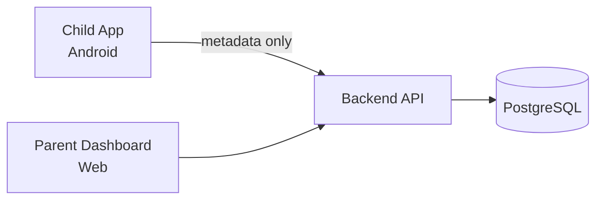

# Software Requirements Specification (SRS)

**Project:** SafeGuard — AI Parental Control Platform
**Author:** Helmi Megdiche — ESPRIT (5th-year PFE)
**Internship period:** 01/02/2026 – 31/07/2026
**Repository:** [github.com/Helmi-Megdiche/PFE](https://github.com/Helmi-Megdiche/PFE)
**Document version:** 1.0 (final)
**Standard reference:** adapted from IEEE 830 / ISO/IEC/IEEE 29148

---

## Table of Contents

1. [Introduction](#1-introduction)
2. [Overall Description](#2-overall-description)
3. [Stakeholders and Actors](#3-stakeholders-and-actors)
4. [Functional Requirements](#4-functional-requirements)
5. [Non-Functional Requirements](#5-non-functional-requirements)
6. [External Interface Requirements](#6-external-interface-requirements)
7. [Data Requirements](#7-data-requirements)
8. [Constraints and Assumptions](#8-constraints-and-assumptions)
9. [Requirements Traceability Matrix](#9-requirements-traceability-matrix)
10. [Glossary](#10-glossary)

---

## 1. Introduction

### 1.1 Purpose

This document specifies the functional and non-functional requirements of **SafeGuard**, an intelligent parental-control platform developed as a final-year engineering project (PFE). It is the authoritative reference for what the system must do, the quality attributes it must satisfy, and the boundaries of the delivered `v1.0-final` release. It is intended for the academic jury, the internship host, and any engineer who continues the project.

### 1.2 Scope

SafeGuard adds a layer of **behavioural intelligence** on top of classic parental controls. Rather than only blocking apps or setting timers, it:

- analyses on-device screen content to detect risky material (adult, violent, toxic, dangerous challenges);
- scores longitudinal behaviour (a daily *addiction* risk score and a daily *digital wellbeing* score);
- responds with gamified, age-appropriate **real-world and cognitive missions**;
- gives parents visibility and control through a web dashboard (monitoring, mission approval, rewards, interests).

The delivered product consists of three subsystems:

| Subsystem | Technology | Delivery status |
|-----------|-----------|-----------------|
| Child application | React Native 0.74.5 (Android) | Delivered |
| Backend API + scoring | Node.js + Express + PostgreSQL | Delivered |
| Parent dashboard | Static HTML/JS served by the API (`/demo.html`) | Delivered (web, not native) |

**Out of scope for v1.0-final:** iOS build, native parent mobile app, classic controls (app blocking, geofencing, remote lock), push notifications (FCM), and multi-child management at production grade. These are recorded as future work in [PREFINAL_REPORT.md](PREFINAL_REPORT.md) §5.

### 1.3 Definitions

See the [Glossary](#10-glossary) (§10).

### 1.4 References

- [README.md](../README.md) — build, run, and per-sprint feature notes
- [PREFINAL_REPORT.md](PREFINAL_REPORT.md) — technical report and honest limitations
- [architecture.md](architecture.md) — component and deployment views
- [scoring_formulas.md](scoring_formulas.md) — mathematical scoring definitions
- [testing_strategy.md](testing_strategy.md) — verification approach
- Two *cahiers des charges* (addiction/wellbeing analytics; screen content analysis + missions)

---

## 2. Overall Description

### 2.1 Product perspective

SafeGuard is a self-contained prototype, not a plug-in for an existing commercial product. The child app captures the screen locally, runs the full AI pipeline on-device, and transmits **only text previews and numeric scores** to the backend. The backend persists events, computes daily scores on a cron schedule, generates missions, and exposes a REST API consumed by both the child app and the parent dashboard.

### 2.2 Product functions (summary)

1. Consent-based screen capture and on-device multilingual OCR + vision classification.
2. Per-capture combined risk scoring and risky-event reporting.
3. Daily addiction and wellbeing scoring from usage sessions and mission proxies.
4. Automatic and cumulative mission generation, with cooldown and resurface logic.
5. Mission delivery via a system overlay on third-party apps, plus in-app fallback.
6. Gamification: points, levels, badges, and parent-defined redeemable rewards.
7. Parent oversight: monitoring, mission approval/rejection, bonus points, interests, custom missions.

### 2.3 User classes

| Class | Description | Technical proficiency |
|-------|-------------|-----------------------|
| **Child** | Owner of the monitored Android device; completes missions, earns points, claims rewards | Low–medium |
| **Parent** | Supervises via the web dashboard; approves missions, manages rewards and interests | Low–medium |
| **Supervisor / Jury** | Uses debug tools to validate OCR and classification | Medium–high |
| **Developer / Operator** | Deploys, migrates the database, and monitors logs | High |

### 2.4 Operating environment

- **Child device:** Android API 29+ (tested on Xiaomi/MIUI), with MediaProjection, Usage Access (optional), and "Display over other apps".
- **Backend:** Node.js 18/20, PostgreSQL 14+ (16 in Docker), Linux or Windows host.
- **Dashboard:** modern desktop browser served same-origin from the API.

### 2.5 Design and implementation constraints

- On-device AI only for the production capture path (privacy invariant — see NFR-P1).
- React Native 0.74.5 pins the native module set (Yahoo Open NSFW TFLite, ML Kit, Tesseract `ara`).
- JWT authentication with development token minting; no production identity provider.
- Single Node process + single PostgreSQL instance (no horizontal-scale story in v1.0-final).

---

## 3. Stakeholders and Actors

| Actor | Goals | Key interactions |
|-------|-------|------------------|
| Child | Understand why content is risky, earn rewards | Grant consent, complete missions, claim rewards |
| Parent | Protect and guide the child without pure restriction | Review events/scores, approve missions, define rewards/interests |
| Backend cron | Keep daily scores current | Nightly aggregation at 01:00 |
| Supervisor/Jury | Validate detection quality | Debug classify / Arabic OCR endpoints |

---

## 4. Functional Requirements

Requirements are grouped by capability. Each has a stable ID (`FR-<area>-<n>`), a priority (**M**ust / **S**hould / **C**ould), and a verification method (T = automated test, D = demo/manual, I = inspection).

### 4.1 Screen capture and consent (FR-CAP)

| ID | Requirement | Priority | Verify |
|----|-------------|----------|--------|
| FR-CAP-1 | The child app SHALL request explicit MediaProjection consent before any capture begins. | M | D |
| FR-CAP-2 | The system SHALL run a persistent foreground service with a visible notification while capturing (Android 14+ requirement). | M | D |
| FR-CAP-3 | The app SHALL capture the screen periodically with an **adaptive interval** derived from recent risk (10 s / 15 s / 20 s tiers). | M | T (`adaptiveCapture`) |
| FR-CAP-4 | The app SHALL trigger an immediate capture on app-switch and a follow-up capture ~5 s later, subject to a 5 s debounce. | M | T (`appSwitchCapture`) |
| FR-CAP-5 | The periodic interval SHALL be adjusted by foreground app category (browsers/social ≤ 15 s; games/launchers app-switch-only; education ≥ 120 s). | S | T (`appCapturePolicy`) |
| FR-CAP-6 | The captured JPEG SHALL be deleted from device storage immediately after processing. | M | I |
| FR-CAP-7 | The pipeline SHALL self-recover from a hung frame (processing watchdog, OCR-lock takeover after 8 s, wedged foreground-lookup skip after 2.5 s). | M | I |

### 4.2 Foreground attribution (FR-FG)

| ID | Requirement | Priority | Verify |
|----|-------------|----------|--------|
| FR-FG-1 | The app SHALL resolve the foreground app package via UsageStats (120 s events window, 5 s recency fallback). | M | T (`foregroundDetection`) |
| FR-FG-2 | Launcher and `com.android.systemui` packages SHALL never be reported as the active app. | M | T |
| FR-FG-3 | When UsageStats returns a launcher or stale package, the app SHALL infer the real app from OCR (Chrome/Messenger/Instagram cues). | S | T (`inferAppPackageFromOcr`) |
| FR-FG-4 | Concurrent foreground lookups SHALL be single-flighted and self-heal if wedged. | M | I |

### 4.3 On-device OCR (FR-OCR)

| ID | Requirement | Priority | Verify |
|----|-------------|----------|--------|
| FR-OCR-1 | The app SHALL extract text on-device using ML Kit for Latin scripts (EN/FR/Arabizi). | M | D |
| FR-OCR-2 | The app SHALL run Tesseract `ara` as a sequential fallback only when Arabic script or garbled Latin-from-Arabic is detected. | M | T (`arabicOcrTrigger`) |
| FR-OCR-3 | The app SHALL strip UI noise (timestamps, counts, chrome) before keyword matching. | S | T (`cleanOcrText`) |
| FR-OCR-4 | The app SHALL normalise Tunisian Derja Arabizi (digit-letter mapping) for keyword matching. | M | T (`normalizeArabizi`) |
| FR-OCR-5 | Keyword matching SHALL cover English, French, Arabic, and Derja lists. | M | T (`keywordFilterMultilingual`) |
| FR-OCR-6 | Only ≤ 500 characters of extracted text SHALL be transmitted. | M | I |

### 4.4 Risk scoring — per capture (FR-RISK)

| ID | Requirement | Priority | Verify |
|----|-------------|----------|--------|
| FR-RISK-1 | The app SHALL compute a combined risk score as `OCR×0.3 + vision×0.7`, clamped 0–100. | M | T (`riskCombination`) |
| FR-RISK-2 | TFLite (Yahoo Open NSFW) SHALL own adult/suggestive classification; ML Kit labels SHALL contribute non-adult risk. | M | T (`riskMapping`, `nsfwClassifier`) |
| FR-RISK-3 | An explicit adult keyword SHALL be able to floor image risk when the vision model is timid (`applyExplicitOcrBoost`). | S | T (`riskCombination`) |
| FR-RISK-4 | Filtered search-results pages (SafeSearch / Mode IA) SHALL be capped unless an explicit search-box query is detected. | M | T (`riskySearchContext`) |
| FR-RISK-5 | Launcher recents-widget-only captures SHALL be neutralised. | S | T (`launcherCaptureContext`) |
| FR-RISK-6 | Known benign contexts (social inbox home) SHALL be filtered to reduce false positives. | S | T (`benignRiskContext`) |

### 4.5 Risk scoring — daily (FR-SCORE)

| ID | Requirement | Priority | Verify |
|----|-------------|----------|--------|
| FR-SCORE-1 | The backend SHALL compute a daily **addiction** score from five weighted components (intensity, compulsivity, night usage, escalation, real imbalance). | M | T (`scoringEngine`) |
| FR-SCORE-2 | The backend SHALL add a weekly **exposure penalty** (`min(20, riskyCount×2)`) to the stored addiction score. | M | T (`scoringEngine`) |
| FR-SCORE-3 | The backend SHALL compute a daily **wellbeing** score from five weighted components (screen balance, content quality, real activity, sleep consistency, family interaction). | M | T (`scoringEngine`) |
| FR-SCORE-4 | Dynamic wellbeing proxies (physical activity, bedtime variance, family interaction) SHALL be derived from missions and usage. | M | T (`wellbeingProxies`) |
| FR-SCORE-5 | A `node-cron` job SHALL run daily at 01:00 to aggregate usage and upsert `daily_scores` per child. | M | I |
| FR-SCORE-6 | Scores and a multi-day trend SHALL be retrievable via the API. | M | D |

### 4.6 Mission generation (FR-MIS)

| ID | Requirement | Priority | Verify |
|----|-------------|----------|--------|
| FR-MIS-1 | A risky screen event SHALL be able to generate a mission when combined risk exceeds an **adaptive threshold** (7-day avg + 10, clamped 50–80). | M | T (`missionGenerator`) |
| FR-MIS-2 | A **cumulative burst** (sum of last 5 scores in 30 min > 300, ≥ 3 events) SHALL generate a mission even when single scores are below threshold. | M | T (`missionGenerator`) |
| FR-MIS-3 | The daily cron SHALL generate missions when `wellbeingScore < 40` or `addictionScore > 70`. | M | I |
| FR-MIS-4 | Mission template selection SHALL map risk category to appropriate templates (adult→safety; violent→media-violence; toxic→kindness; dangerous→safety talk). | M | T (`missionGenerator`) |
| FR-MIS-5 | Points SHALL escalate (+30 %/level, max +60 %) after repeated risky-content missions in 24 h. | S | T |
| FR-MIS-6 | At most **3 pending** missions SHALL exist per child; `pending_approval` SHALL NOT count toward this limit. | M | T (`missionHelpers`) |
| FR-MIS-7 | Missions SHALL expire after 24 hours. | M | I |
| FR-MIS-8 | A risky-content cooldown SHALL block *new* missions while a pending — or recently failed/abandoned — risky mission exists, and SHALL **re-surface** the same mission instead. | M | T (`resurfaceCooldown`, `resurface`) |
| FR-MIS-9 | Parent-selected interests SHALL act as a tie-breaker among equally eligible templates. | C | T (`missionGenerator`) |

### 4.7 Mission delivery and completion (FR-DEL)

| ID | Requirement | Priority | Verify |
|----|-------------|----------|--------|
| FR-DEL-1 | A generated/re-surfaced mission SHALL be presented as a system overlay above the foreground app when "Display over other apps" is granted. | M | D |
| FR-DEL-2 | Without overlay permission, the app SHALL fall back to a high-priority notification that opens the in-app mission screen. | M | D |
| FR-DEL-3 | Overlays SHALL respect debounce guards (90 s new-mission, 60 s re-surface, 8 s startup grace, 10 s post-mission grace). | M | T (`missionPresentationGuard`) |
| FR-DEL-4 | Quizzes SHALL pass at ≥ 2/3 correct; cognitive games SHALL score by performance. | M | T (`gameLogic`, `missionCompletion`) |
| FR-DEL-5 | Real-world missions SHALL complete to `pending_approval` and require parent approval before awarding points. | M | T (`missionsApproval`) |
| FR-DEL-6 | Abandoning an active mission (home/app-switch) SHALL apply a −10 point escape penalty after a 3 s grace. | S | T (`missionCompletion`) |

### 4.8 Gamification (FR-GAM)

| ID | Requirement | Priority | Verify |
|----|-------------|----------|--------|
| FR-GAM-1 | Completing a mission SHALL award points and update the child's total. | M | T |
| FR-GAM-2 | Level SHALL be `floor(totalPoints / 500) + 1`. | M | D |
| FR-GAM-3 | Badges SHALL auto-award for point tiers, mission counts, age band, and special milestones. | M | T (`gamificationService`) |
| FR-GAM-4 | Only one age-band badge SHALL be kept per child; mismatched bands SHALL be revoked on birth-year change. | S | T (`gamificationService`) |
| FR-GAM-5 | Parents SHALL create rewards; children SHALL claim them by spending points. | M | D |
| FR-GAM-6 | Cognitive difficulty SHALL adapt on-device from stored performance (`gameStats`). | C | T (`gameLogic`) |

### 4.9 Parent oversight (FR-PAR)

| ID | Requirement | Priority | Verify |
|----|-------------|----------|--------|
| FR-PAR-1 | Parents SHALL view recent screen events with risk filters. | M | D |
| FR-PAR-2 | Parents SHALL view latest scores, a 7-day trend, points, and level. | M | D |
| FR-PAR-3 | Parents SHALL approve or reject pending real-world missions. | M | T (`missionsApproval`) |
| FR-PAR-4 | Parents SHALL award discretionary bonus points. | S | D |
| FR-PAR-5 | Parents SHALL manage child interests from a fixed tag set (`sports`, `art`, `reading`, `family`, `brain`). | S | T (`child.validator`) |
| FR-PAR-6 | Parents SHALL create/update/delete custom real-world missions. | S | T (`customMissionService`) |
| FR-PAR-7 | Parents SHALL read/update child display name and birth year (with age-badge re-award), owning the child. | S | D |

### 4.10 Authentication (FR-AUTH)

| ID | Requirement | Priority | Verify |
|----|-------------|----------|--------|
| FR-AUTH-1 | All `/api/*` routes except `/health`, `/dev/*`, `/debug/*` SHALL require a valid JWT. | M | I |
| FR-AUTH-2 | Development JWTs SHALL be mintable via `/api/dev/*` and expire in 7 days. | M | D |
| FR-AUTH-3 | The child app SHALL detect an expired token on startup and refresh it automatically. | M | T (`jwtUtils`) |
| FR-AUTH-4 | On HTTP 401, the client SHALL clear the token and request a session refresh without crashing capture. | M | I |
| FR-AUTH-5 | The profile screen SHALL offer an explicit "Log out / refresh JWT" action. | S | D |

### 4.11 Debug / validation (FR-DBG)

| ID | Requirement | Priority | Verify |
|----|-------------|----------|--------|
| FR-DBG-1 | Debug endpoints (`/api/debug/classify`, `/api/debug/arabic-ocr`) SHALL accept image uploads for supervisor validation and SHALL be disabled in production. | S | T (`debugPipeline`, `arabicOcr`) |
| FR-DBG-2 | Debug pipelines MAY use server-side nsfwjs/Tesseract and are explicitly **not** the production child path. | S | I |

---

## 5. Non-Functional Requirements

### 5.1 Privacy (NFR-P)

| ID | Requirement |
|----|-------------|
| NFR-P1 | **Privacy invariant:** in production, screenshots SHALL never leave the device; only ≤ 500-char text previews and numeric scores are transmitted. |
| NFR-P2 | The design SHALL follow data-minimisation aligned with GDPR/COPPA principles. |
| NFR-P3 | Monitoring SHALL be preceded by explicit, revocable consent (MediaProjection dialog). |

### 5.2 Performance (NFR-PERF)

| ID | Requirement |
|----|-------------|
| NFR-PERF-1 | The vision + OCR pipeline SHALL complete within a 25 s per-frame budget; frames exceeding it are skipped (`vision_timeout`). |
| NFR-PERF-2 | English-only frames SHALL NOT incur the Arabic Tesseract penalty. |
| NFR-PERF-3 | A minimum 5 s debounce SHALL bound OCR/vision load between captures. |
| NFR-PERF-4 | API requests SHALL time out at 12 s on the client to avoid blocking the pipeline. |

### 5.3 Reliability (NFR-REL)

| ID | Requirement |
|----|-------------|
| NFR-REL-1 | A hung native/API call SHALL NOT permanently stall capture (watchdog + generation token + self-heal). |
| NFR-REL-2 | The backend SHALL be idempotent on daily score upsert (`UNIQUE (child_id, score_date)`). |
| NFR-REL-3 | Duplicate mission overlays SHALL be prevented by the debounce/grace guards. |

### 5.4 Usability (NFR-USE)

| ID | Requirement |
|----|-------------|
| NFR-USE-1 | Beyond consent dialogs and the service notification, monitoring SHALL add no intrusive popups. |
| NFR-USE-2 | Parent actions SHALL provide immediate feedback (toasts) on the dashboard. |
| NFR-USE-3 | Missions SHALL be age-adapted using the child's birth year. |

### 5.5 Security (NFR-SEC)

| ID | Requirement |
|----|-------------|
| NFR-SEC-1 | API routes SHALL be JWT-protected; secrets SHALL be provided via environment variables. |
| NFR-SEC-2 | Helmet and CORS SHALL be configured on the API. |
| NFR-SEC-3 | Input SHALL be validated (Joi) on write endpoints (e.g. interests, preview length ≤ 500). |

### 5.6 Maintainability (NFR-MNT)

| ID | Requirement |
|----|-------------|
| NFR-MNT-1 | Pure scoring/risk/mission logic SHALL be unit-tested (310 automated tests at final). |
| NFR-MNT-2 | Risk keyword lists and label mappings SHALL be shared/parallel between mobile and backend. |
| NFR-MNT-3 | Database changes SHALL be expressed as sequential SQL migrations. |

### 5.7 Portability (NFR-PORT)

| ID | Requirement |
|----|-------------|
| NFR-PORT-1 | The backend SHALL run on Node 18/20 and PostgreSQL 14+; the database SHALL be runnable via Docker Compose. |
| NFR-PORT-2 | The child app targets Android API 29+; iOS is out of scope. |

---

## 6. External Interface Requirements

### 6.1 User interfaces

- **Child app:** bottom-tab navigation — Monitor, Missions, Rewards, Badges, Profile — plus a blocking mission screen and system overlay.
- **Parent dashboard:** Monitoring tab (events, trend chart, debug tools) and Parent tab (profile, scores, approvals, rewards, interests, custom missions).

### 6.2 Software interfaces (REST API)

All under `/api`. JWT required except where noted. Full surface in [architecture.md](architecture.md) §6 and [README.md](../README.md).

| Prefix | Roles | Purpose |
|--------|-------|---------|
| `GET /health` | Public | Health check |
| `/dev/*`, `/debug/*` | Dev only | Token minting; image classify / Arabic OCR |
| `/screen-events` | Child POST, Parent GET | Risky-event ingestion + mission trigger |
| `/usage` | Child POST, Parent GET | Foreground session batching |
| `/scores` | Parent GET | Daily scores, trend, level |
| `/missions` | Child + Parent | Generate, list, complete, approve, reject, abandon |
| `/rewards` | Parent + Child | Reward catalogue and claims |
| `/badges` | Parent + Child | Earned badges |
| `/bonus` | Parent | Discretionary points |
| `/custom-missions` | Parent | Parent-defined real-world missions |
| `/child` | Parent | Profile and interests |

### 6.3 Hardware interfaces

Android MediaProjection (screen frames), UsageStatsManager (foreground app), SYSTEM_ALERT_WINDOW (overlay), device storage (temporary JPEG).

### 6.4 Communication interfaces

HTTP/JSON over LAN in development (`DEV_LAN_HOST:3000`); HTTPS recommended in production (see [deployment.md](deployment.md)).

---

## 7. Data Requirements

Primary entities (see [architecture.md](architecture.md) §5 for the full schema and 15 migrations):

| Entity | Purpose |
|--------|---------|
| `users` | Parent/child accounts (role-checked) |
| `children` | Child profile, `birth_year`, `interests` (JSONB) |
| `screen_events` | Risk metadata per capture (no images) |
| `usage_sessions` | Foreground app sessions (for scoring) |
| `daily_scores` | Addiction/wellbeing scores + components, unique per day |
| `missions` | Generated missions with status lifecycle |
| `rewards`, `custom_missions` | Parent-created catalogues |
| `badges`, `child_badges`, `child_points` | Gamification state |
| `quiz_questions` | Age-filtered quiz bank |

**Retention/minimisation:** only text previews (≤ 500 chars) and scores are stored for screen events; raw images are never persisted server-side.

---

## 8. Constraints and Assumptions

### 8.1 Constraints

- Production capture path is **on-device only** (no cloud vision).
- RN 0.74.5 pins the native ML stack; model changes require an Android rebuild.
- Single-node backend and single PostgreSQL instance.
- Dashboard is web-only and served same-origin from the API.

### 8.2 Assumptions

- The child device grants MediaProjection and (ideally) Usage Access and overlay permissions.
- Phone and backend share a LAN in development; firewall allows TCP 3000.
- The parent supervises via a desktop browser.
- Real-world mission completion is honour-based (no sensor verification).

### 8.3 Known limitations (authoritative list)

The complete, honest limitation map is maintained in [PREFINAL_REPORT.md](PREFINAL_REPORT.md) §4 (product shape, platform, screen AI, scoring, missions, parent experience, privacy/ops). Notable items: heuristic (non-YOLO/CLIP) vision, proxy-based wellbeing, honour-system missions, UTC date boundaries, dev-grade JWT auth, and web-only parent experience.

---

## 9. Requirements Traceability Matrix

| Requirement area | Implementation (key files) | Verification |
|------------------|----------------------------|--------------|
| FR-CAP | `MobileApp/src/hooks/useScreenshotCapture.ts`, `utils/adaptiveCapture.ts`, `utils/appCapturePolicy.ts` | `adaptiveCapture`, `appCapturePolicy`, `appSwitchCapture` tests |
| FR-FG | `src/native/ForegroundApp.ts`, `ForegroundAppModule.java`, `utils/inferAppPackageFromOcr.ts` | `foregroundDetection`, `inferAppPackageFromOcr` tests |
| FR-OCR | `src/services/mixedScriptOcr.ts`, `utils/cleanOcrText.ts`, `utils/normalizeArabizi.ts`, `utils/keywordFilter.ts` | `normalizeArabizi`, `cleanOcrText`, `keywordFilterMultilingual`, `arabicOcrTrigger` tests |
| FR-RISK | `src/utils/riskCombination.ts`, `riskySearchContext.ts`, `benignRiskContext.ts`, `launcherCaptureContext.ts` | `riskCombination`, `riskySearchContext`, `benignRiskContext`, `launcherCaptureContext`, `nsfwClassifier` tests |
| FR-SCORE | `backend/src/scoring/scoringEngine.ts`, `wellbeingProxies.ts`, `jobs/dailyScoreJob.ts` | `scoringEngine`, `wellbeingProxies` tests |
| FR-MIS | `backend/src/services/missionGenerator.ts`, `missionHelpers.ts` | `missionGenerator`, `missionHelpers`, `resurface`, `resurfaceCooldown` tests |
| FR-DEL | `MobileApp/src/missions/presentMissionFromCapture.ts`, `utils/missionPresentationGuard.ts`, `screens/missions/*` | `missionPresentationGuard`, `gameLogic`, `missionCompletion` tests |
| FR-GAM | `backend/src/services/gamificationService.ts`, `MobileApp/src/missions/games/*` | `gamificationService`, `gameLogic` tests |
| FR-PAR | `backend/src/routes/*.routes.ts`, `demo_dashboard.html` | `missionsApproval`, `customMissionService`, `child.validator` tests |
| FR-AUTH | `MobileApp/src/auth/*`, `services/apiClient.ts`, `backend/src/middleware/verifyToken.ts` | `jwtUtils` test; inspection |
| FR-DBG | `backend/src/routes/debug.routes.ts` | `debugPipeline`, `arabicOcr` tests |

---

## 10. Glossary

| Term | Meaning |
|------|---------|
| **Adaptive threshold** | Per-child mission trigger = 7-day average combined risk + 10, clamped 50–80 |
| **Arabizi** | Latin-script transliteration of Arabic/Tunisian Derja using digits (e.g. `3` = ع) |
| **Combined risk** | Per-capture score = OCR×0.3 + vision×0.7 |
| **Cumulative burst** | Mission trigger when the sum of the last 5 risk scores in 30 min exceeds 300 |
| **Exposure penalty** | Addiction adjustment from weekly risky-event count (`min(20, count×2)`) |
| **MediaProjection** | Android API used to capture the screen |
| **Mode IA** | Chrome AI-search results view; treated as a filtered SERP |
| **Resurface** | Re-presenting an existing mission during cooldown instead of creating a new one |
| **SERP** | Search Engine Results Page |
| **TFLite NSFW** | Yahoo Open NSFW model running on-device for adult classification |
| **UsageStats** | Android API used to determine the foreground app |

---

*End of Software Requirements Specification — SafeGuard v1.0-final.*
