# Architecture — SafeGuard AI Parental Control Platform

**Author:** Helmi Megdiche — ESPRIT (5th-year PFE)
**Repository:** [github.com/Helmi-Megdiche/PFE](https://github.com/Helmi-Megdiche/PFE)
**Document version:** 1.0 (final)
**Scope:** logical, component, data, runtime, and deployment views of `v1.0-final`.

---

## Table of Contents

1. [Architectural Overview](#1-architectural-overview)
2. [Logical (Layered) View](#2-logical-layered-view)
3. [Component View](#3-component-view)
4. [Runtime / Data-Flow View](#4-runtime--data-flow-view)
5. [Data Model](#5-data-model)
6. [API Surface](#6-api-surface)
7. [On-Device AI Pipeline](#7-on-device-ai-pipeline)
8. [Backend Internals](#8-backend-internals)
9. [Deployment View](#9-deployment-view)
10. [Cross-Cutting Concerns](#10-cross-cutting-concerns)
11. [Architectural Decisions (ADRs)](#11-architectural-decisions-adrs)

---

## 1. Architectural Overview

SafeGuard is a **three-tier, privacy-first** system:

- **Tier 1 — Child device (Android).** Captures the screen, runs the full AI stack on-device, computes per-capture risk, and posts **metadata only** to the backend. Also presents missions via a system overlay.
- **Tier 2 — Backend (Node.js + PostgreSQL).** Ingests events, persists usage, computes daily scores on a cron, generates missions, and serves a REST API.
- **Tier 3 — Parent dashboard (web).** A static HTML/JS app served same-origin by the backend for monitoring and control.

The central architectural principle is the **privacy invariant**: raw screenshots never leave the device on the production path. This constraint drives most downstream decisions (on-device OCR/vision, metadata-only API, debug endpoints kept out of production).

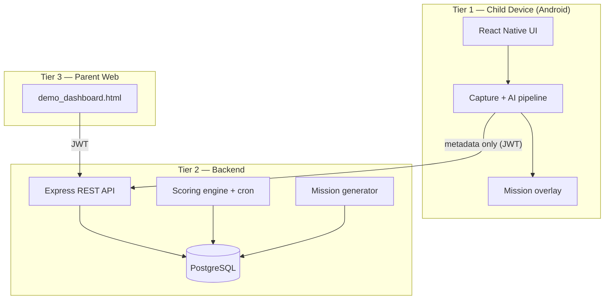

---

## 2. Logical (Layered) View

| Layer | Child app | Backend |
|-------|-----------|---------|
| **Presentation** | React Navigation screens, overlay | `demo_dashboard.html` (served) |
| **Application / orchestration** | `useScreenshotCapture`, `presentMissionFromCapture`, hooks | Route handlers (`*.routes.ts`) |
| **Domain / logic** | risk combination, OCR pipeline, keyword filter, capture policy | scoring engine, mission generator, gamification |
| **Integration** | `apiClient`, native modules (JNI) | `pg` pool, `node-cron` |
| **Data** | AsyncStorage (token, game stats) | PostgreSQL (15 migrations) |

The domain layers on both sides are **pure and unit-tested**, which is why the project sustains 310 automated tests (see [testing_strategy.md](testing_strategy.md)).

---

## 3. Component View

### 3.1 Child application (`MobileApp/`)

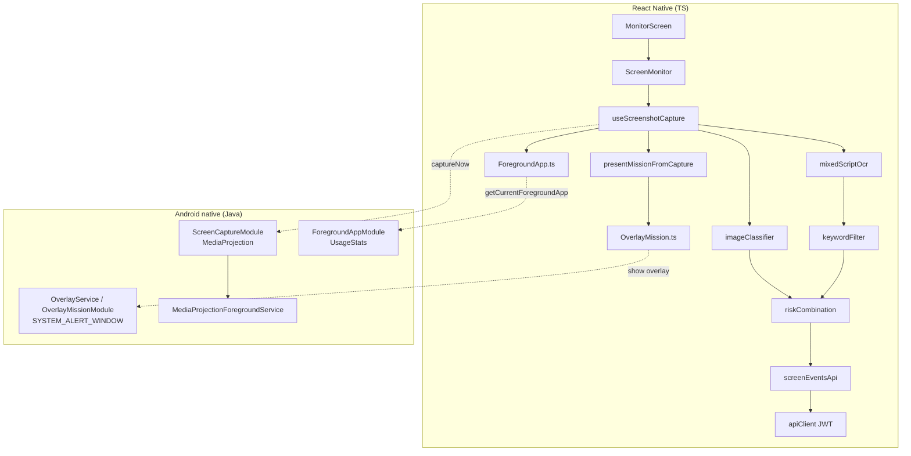

| Component | Path | Responsibility |
|-----------|------|----------------|
| Capture orchestration | `src/hooks/useScreenshotCapture.ts` | Adaptive scheduling, debounce, pipeline, API post, mission presentation, self-heal |
| OCR | `src/services/mixedScriptOcr.ts` (+ `mobileArabicOcr.ts`) | ML Kit → optional Tesseract `ara` |
| Vision | `src/services/imageClassifier.ts`, `nsfwClassifier.ts` | TFLite NSFW + ML Kit labels |
| Risk logic | `src/utils/riskCombination.ts`, `riskySearchContext.ts`, `benignRiskContext.ts`, `launcherCaptureContext.ts` | Combined score + context corrections |
| Foreground | `src/native/ForegroundApp.ts`, `utils/inferAppPackageFromOcr.ts` | Package resolution + OCR override |
| Missions UI | `src/missions/*`, `src/screens/missions/*` | Overlay presentation, games, completion |
| Auth | `src/auth/*`, `services/apiClient.ts` | JWT lifecycle, 401 handling |
| Native (Java) | `android/app/src/main/java/com/mobileapp/{screencapture,foreground,overlay}` | MediaProjection, UsageStats, overlay window |

### 3.2 Backend (`backend/`)

| Component | Path | Responsibility |
|-----------|------|----------------|
| HTTP entry | `src/index.ts`, `routes/index.ts` | Express app, Helmet/CORS, route mounting, JWT gate |
| Auth middleware | `src/middleware/verifyToken.ts` | JWT verification, role attach |
| Screen events | `src/routes/screenEvents.routes.ts` | Store metadata → `generateMissionFromRisk` → resurface |
| Usage | `src/routes/usage.routes.ts` | Batch session insert; parent read |
| Scores | `src/routes/scores.routes.ts` | Daily scores, trend, level |
| Missions | `src/routes/missions.routes.ts` | CRUD, complete, approve, reject, abandon |
| Rewards/Badges/Bonus | `src/routes/{rewards,badges,bonus}.routes.ts` | Gamification API |
| Custom missions / Child | `src/routes/{customMissions,child}.routes.ts` | Parent catalogues, profile, interests |
| Scoring | `src/scoring/{scoringEngine,aggregateUsage,wellbeingProxies}.ts` | Addiction/wellbeing formulas + proxies |
| Mission logic | `src/services/{missionGenerator,missionHelpers,gamificationService}.ts` | Decision tree, cooldown, badges |
| Cron | `src/jobs/dailyScoreJob.ts` | Nightly aggregation (01:00) |
| Debug | `src/routes/debug.routes.ts` | nsfwjs/Tesseract classify (dev only) |
| Data | `src/db/migrations/*.sql`, `db/migrate.ts` | Schema + runner |

### 3.3 Parent dashboard

Self-contained `demo_dashboard.html` (source at repo root) synced to `backend/public/demo.html` via `npm run sync:demo`, served at `http://<host>:3000/demo.html`. Uses `fetchWithAuth` with a parent JWT in `localStorage`.

---

## 4. Runtime / Data-Flow View

### 4.1 Capture → event → mission

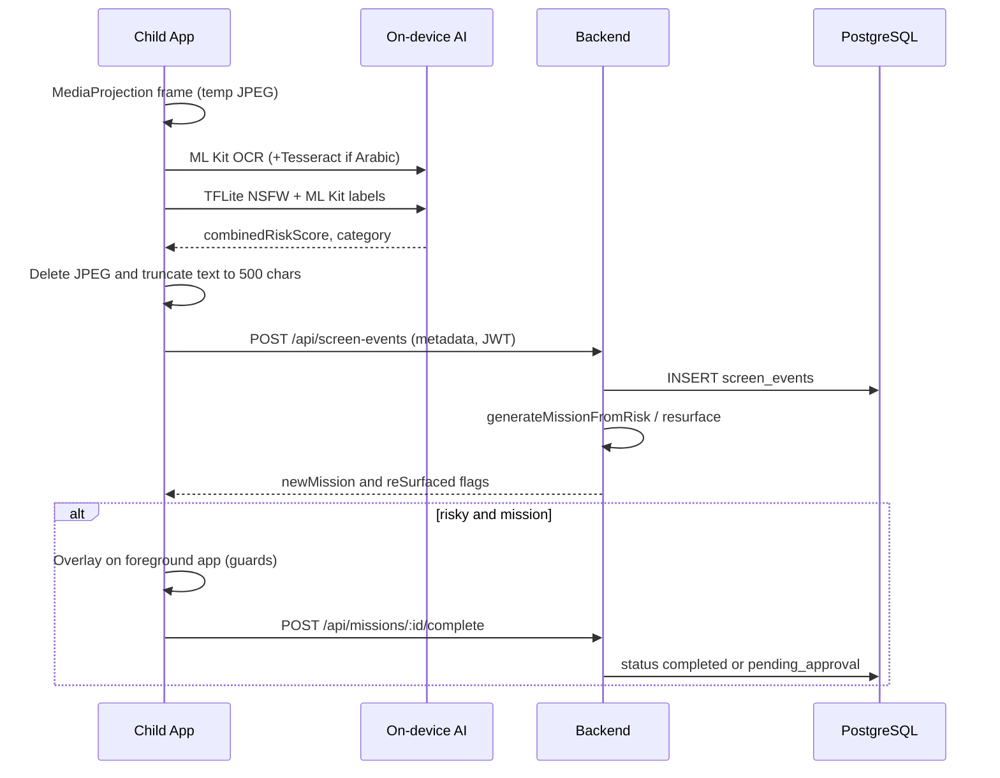

### 4.2 Daily scoring

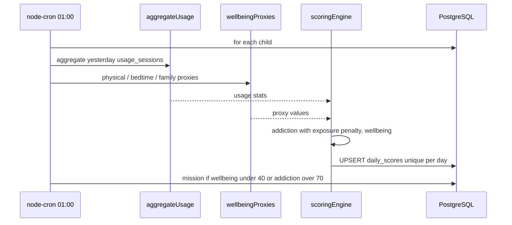

### 4.3 Parent approval

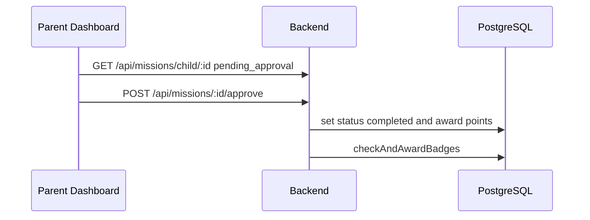

---

## 5. Data Model

15 sequential migrations (`000_init` … `015_badge_cleanup`).

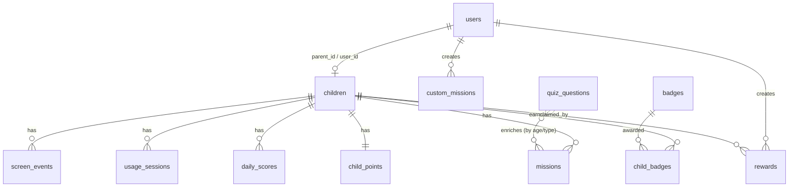

### 5.1 Core tables

| Table | Key columns | Notes |
|-------|-------------|-------|
| `users` | `id`, `email`, `role` (`parent`/`child`), `password_hash` | Role-checked |
| `children` | `id`, `user_id` (unique), `parent_id`, `display_name`, `birth_year`, `interests` JSONB | `interests` added in `014` |
| `screen_events` | `child_id`, `timestamp`, `app_package`, `extracted_text_preview` (≤500), `risk_flag`, `risk_score`, `category`, vision fields | No images; vision fields added in `005` |
| `usage_sessions` | `child_id`, `start_time`, `end_time`, `app_package`, `app_category` | Range-checked; feeds scoring |
| `daily_scores` | `child_id`, `score_date`, `addiction_score`, `wellbeing_score`, 10 component columns | `UNIQUE (child_id, score_date)` |
| `missions` | `child_id`, `title`, `points`, `status`, `trigger_reason`, `metadata` JSONB, `expires_at`, `penalty_applied`, `escaped_at` | Status set extended in `010` |
| `rewards` | `parent_id`, `points_required`, `is_claimed`, `claimed_by_child_id` | Parent catalogue |
| `custom_missions` | `parent_id`, `title`, `points`, `is_active` | Added in `012` |
| `badges` / `child_badges` | `requirement_type`, `requirement_value`/`requirement_config` | Tiers in `008`; cleanup in `015` |
| `child_points` | `child_id`, `total_points` | Level = `floor(points/500)+1` |
| `quiz_questions` | `quiz_type`, `options`, `correct_answer_index`, `age_min/max` | Added in `011`, extended `013` |

### 5.2 Migration inventory

| # | File | Adds |
|---|------|------|
| 000 | `000_init.sql` | `pgcrypto`, `users`, `children` |
| 001 | `001_screen_events.sql` | `screen_events` |
| 002 | `002_dev_seed.sql` | Seeded parent/child for dev |
| 003 | `003_usage_sessions.sql` | `usage_sessions`, `daily_scores` |
| 005 | `005_add_tflite_risk.sql` | Vision fields on `screen_events` |
| 006 | `006_add_app_label.sql` | `app_label` |
| 007 | `007_missions_gamification.sql` | `missions`, `rewards`, `badges`, `child_badges`, `child_points` |
| 008 | `008_add_smart_badges.sql` | Point/mission/age badge tiers |
| 009 | `009_add_screen_events_child_created_idx.sql` | Index for cumulative-burst query |
| 010 | `010_parent_approval_escape.sql` | `pending_approval`/`failed` statuses, penalty columns |
| 011 | `011_quiz_questions.sql` | `quiz_questions` |
| 012 | `012_custom_missions.sql` | `custom_missions` |
| 013 | `013_quiz_media_violence.sql` | Media-violence quiz seeds |
| 014 | `014_child_interests.sql` | `children.interests` JSONB |
| 015 | `015_badge_cleanup.sql` | Remove legacy duplicate badges |

> Note: there is no `004`; numbering skips it (historical). The runner applies files in lexical order.

---

## 6. API Surface

Registered in `backend/src/routes/index.ts`. `/health` is public; `/dev/*` and `/debug/*` are mounted **only when not production**; everything else requires `Authorization: Bearer <JWT>`.

| Method | Path | Role | Purpose |
|--------|------|------|---------|
| GET | `/api/health` | Public | Liveness |
| GET | `/api/dev/child-token` / `parent-token` | Dev | Mint JWT (7-day) |
| POST | `/api/debug/classify` / `arabic-ocr` | Dev | Server-side vision/OCR validation |
| POST | `/api/screen-events` | Child | Ingest event; trigger mission |
| GET | `/api/screen-events/:childId` | Parent | List events |
| POST | `/api/usage` | Child | Batch sessions |
| GET | `/api/usage/:childId` | Parent | Sessions for a day |
| GET | `/api/scores/:childId` | Parent | Latest/dated scores + level |
| GET | `/api/scores/:childId/trend` | Parent | N-day trend |
| POST | `/api/missions/suggest` / `generate` | Child / Dev | Create mission |
| GET | `/api/missions/child/:childId` | Child/Parent | List by status |
| POST | `/api/missions/:id/complete` | Child | Complete (real_world→approval) |
| POST | `/api/missions/:id/approve` / `reject` | Parent | Approval workflow |
| POST | `/api/missions/:id/abandon` | Child | Escape penalty |
| GET/POST/PUT/DELETE | `/api/rewards` (+`/:id/claim`) | Parent/Child | Rewards |
| GET | `/api/badges` (+`/child/:childId`) | Any/Child+Parent | Badges |
| POST | `/api/bonus/child/:childId` | Parent | Bonus points |
| GET/POST/PUT/DELETE | `/api/custom-missions` | Parent | Custom missions |
| GET/PUT | `/api/child/profile` / `interests` | Parent | Profile + interests |

---

## 7. On-Device AI Pipeline

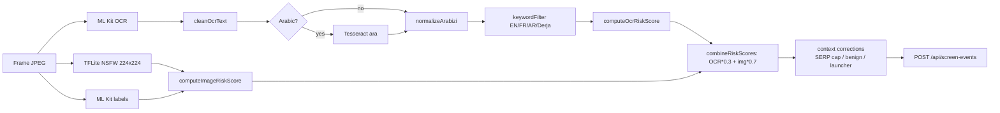

**Design rationale.** OCR runs strictly before the optional Tesseract pass to avoid ML Kit/Tesseract concurrency and to keep non-Arabic frames fast. Vision uses a lightweight, RN-0.74-compatible NSFW model rather than an on-device multi-head network. Context correctors (`riskySearchContext`, `benignRiskContext`, `launcherCaptureContext`) reduce false positives from filtered SERPs, social inboxes, and launcher thumbnails.

Full formulas are in [scoring_formulas.md](scoring_formulas.md).

---

## 8. Backend Internals

### 8.1 Mission decision tree (`pickMissionTemplate`)

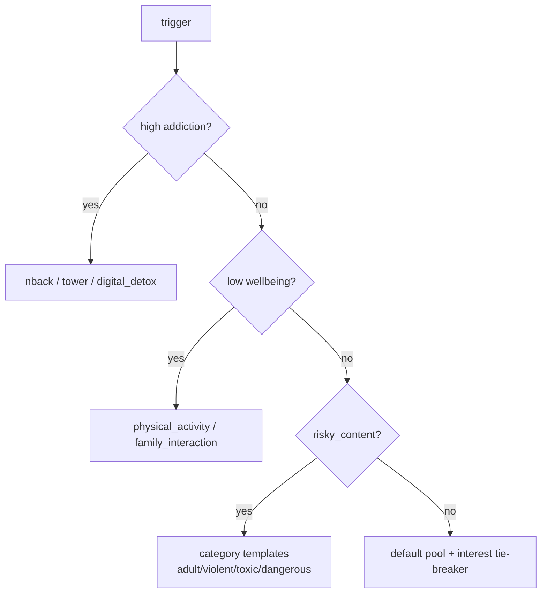

### 8.2 Cooldown & resurface state machine

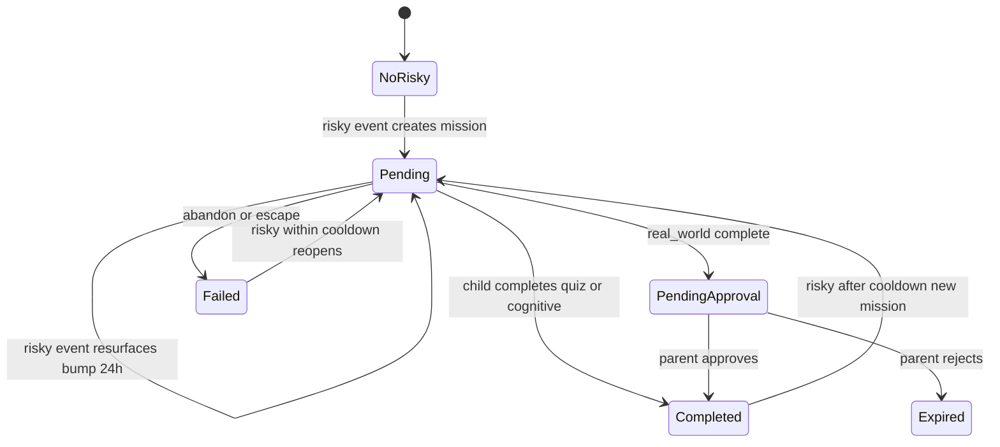

`pending_approval` does **not** count toward the 3-pending limit and does **not** block a new risky mission. `failed` (abandoned) within the cooldown window blocks new creation and triggers a re-surface of the same mission.

---

## 9. Deployment View

### 9.1 Development topology

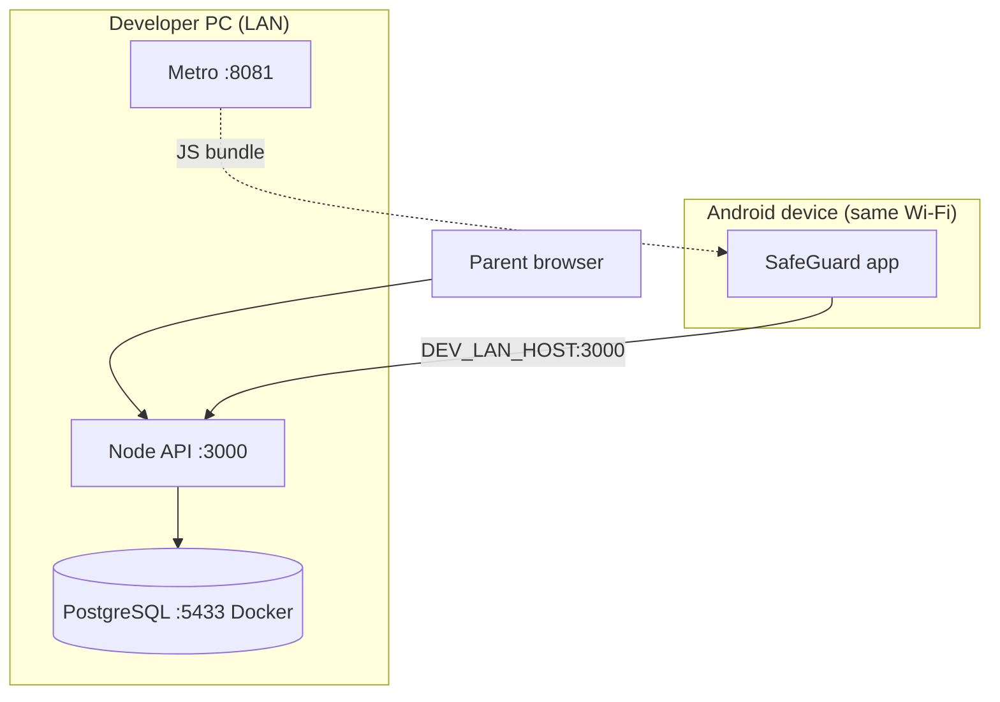

- Emulator uses `10.0.2.2:3000`; a physical device uses `DEV_LAN_HOST` from `apiConfig.ts`.
- PostgreSQL runs in Docker on host port **5433** (avoids clashing with a local PG).

### 9.2 Production topology (recommended)

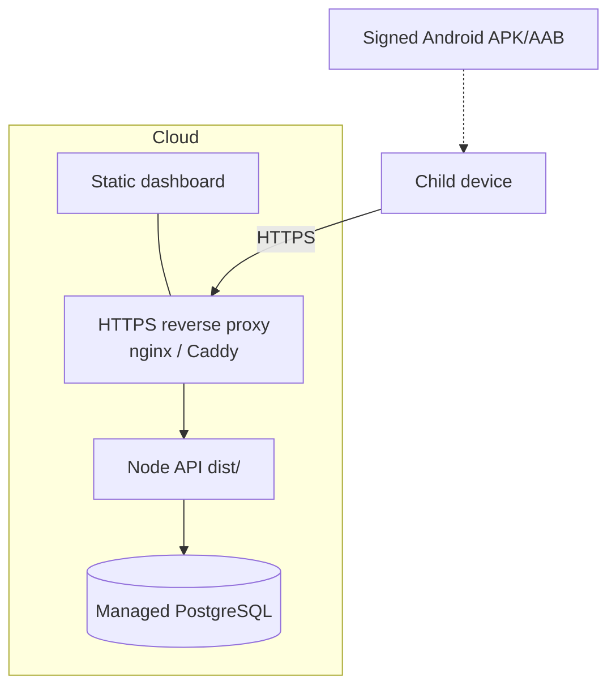

Production notes: build with `npm run build` and serve `dist/`; set `NODE_ENV=production` (disables `/dev` + `/debug`); terminate TLS at a proxy; use a managed PostgreSQL with backups. Full steps in [deployment.md](deployment.md).

---

## 10. Cross-Cutting Concerns

| Concern | Approach |
|---------|----------|
| **Privacy** | On-device AI; metadata-only API; images never persisted server-side; debug endpoints dev-only |
| **Security** | JWT gate on `/api/*`; Helmet + CORS; Joi validation; env-provided secrets |
| **Reliability** | Processing watchdog, OCR-lock takeover, foreground self-heal, generation token; idempotent score upsert |
| **Observability** | Structured JSON logs (backend), Metro `[ScreenCapture]` logs (mobile) |
| **Performance** | Adaptive capture, 25 s vision budget, 5 s debounce, Arabic Tesseract gating |
| **Config** | `backend/.env` (env), `MobileApp/src/config/apiConfig.ts` (LAN host) |
| **i18n of risk** | Parallel EN/FR/AR/Derja keyword lists on mobile and backend |

---

## 11. Architectural Decisions (ADRs)

Condensed decision log; rationale expanded in [PREFINAL_REPORT.md](PREFINAL_REPORT.md) §3.

| ADR | Decision | Rationale | Consequence |
|-----|----------|-----------|-------------|
| ADR-1 | On-device AI, metadata-only API | Privacy invariant (GDPR/COPPA alignment) | No cloud vision; model updates need app rebuild |
| ADR-2 | Yahoo Open NSFW TFLite over custom EfficientNet | RN 0.74 compatibility + stability | Binary-ish adult signal; training pipeline archived |
| ADR-3 | ML Kit first, Tesseract `ara` fallback | Speed on Latin, coverage on Arabic | Sequential pipeline; up to 25 s on Arabic frames |
| ADR-4 | OCR (30%) + vision (70%) weighting | Thumbnails/UI text carry strong signals | Keyword-heavy events; context correctors needed |
| ADR-5 | Adaptive + app-aware capture | Battery vs responsiveness | Native 20 s loop remains as background driver |
| ADR-6 | Overlay-before-pause presentation | MIUI mis-attribution fix | Requires SYSTEM_ALERT_WINDOW; notification fallback |
| ADR-7 | Cooldown + resurface (no spam) | Prevent bypass by completing then returning | More complex mission state machine |
| ADR-8 | Web dashboard, not native parent app | PFE iteration speed | Web-only parent experience; polling not push |
| ADR-9 | Sequential SQL migrations | Simplicity, reviewability | Runner re-runs all files (idempotent DDL) |
| ADR-10 | JWT dev tokens | Sufficient for demo | Production needs real auth + per-route ownership |

---

*End of architecture document — SafeGuard v1.0-final.*
