# Architecture — SafeGuard AI Parental Control Platform

**Author:** Helmi Megdiche — ESPRIT (5th-year PFE)
**Repository:** [github.com/Helmi-Megdiche/PFE_optimization](https://github.com/Helmi-Megdiche/PFE_optimization)
**Document version:** Current `main` (post-Phase B, September 2026). v1.0-final (5 June 2026, `59da85b`) was the pre-Phase-B release.
**Scope:** logical, component, data, runtime, and deployment views of the current system.

---

## Table of Contents

1. [Architectural Overview](#1-architectural-overview)
2. [Logical (Layered) View](#2-logical-layered-view)
3. [Component View](#3-component-view)
4. [Runtime / Data-Flow View](#4-runtime--data-flow-view)
5. [Data Model](#5-data-model)
6. [API Surface](#6-api-surface)
7. [On-Device AI Pipeline](#7-on-device-ai-pipeline)
8. [Backend Internals](#8-backend-internals)
9. [Deployment View](#9-deployment-view)
10. [Cross-Cutting Concerns](#10-cross-cutting-concerns)
11. [Architectural Decisions (ADRs)](#11-architectural-decisions-adrs)

---

## 1. Architectural Overview

SafeGuard is a **three-tier, privacy-first** system:

- **Tier 1 — Child device (Android).** Captures the screen, runs the full AI stack on-device, computes per-capture risk, and posts **metadata only** to the backend. Presents missions via a system overlay, and blocks known and learned adult domains in Chrome through an Accessibility service.
- **Tier 2 — Backend (Node.js + PostgreSQL).** Ingests events, persists usage, computes daily scores on a cron, generates missions, and serves a REST API.
- **Tier 3 — Parent dashboard (web).** A static HTML/JS app served same-origin by the backend for monitoring and control.

The central architectural principle is the **privacy invariant**: raw screenshots never leave the device on the production path. This constraint drives most downstream decisions (on-device OCR/vision, metadata-only API, debug endpoints kept out of production).

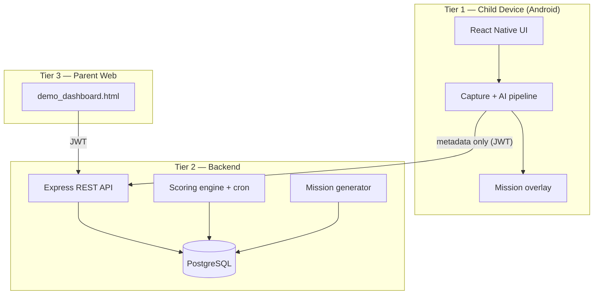

---

## 2. Logical (Layered) View

| Layer | Child app | Backend |
|-------|-----------|---------|
| **Presentation** | React Navigation screens, overlay | `demo_dashboard.html` (served) |
| **Application / orchestration** | `useScreenshotCapture`, `presentMissionFromCapture`, hooks | Route handlers (`*.routes.ts`) |
| **Domain / logic** | risk combination, OCR pipeline, keyword filter, capture policy | scoring engine, mission generator, gamification |
| **Integration** | `apiClient`, native modules (JNI) | `pg` pool, `node-cron` |
| **Data** | AsyncStorage (token, game stats, sync queue); learned-domain file | PostgreSQL (16 migrations + `schema_migrations` ledger) |

The domain layers on both sides are **pure and unit-tested**: 517 mobile Jest, 247 backend Jest and 155 JVM tests (see [testing_strategy.md](testing_strategy.md)).

---

## 3. Component View

### 3.1 Child application (`MobileApp/`)

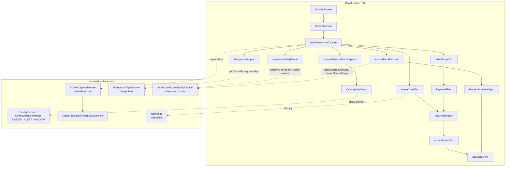

| Component | Path | Responsibility |
|-----------|------|----------------|
| Capture orchestration | `src/hooks/useScreenshotCapture.ts` | Adaptive scheduling, debounce, pipeline, API post, mission presentation, self-heal |
| OCR | `src/services/mixedScriptOcr.ts` (+ `mobileArabicOcr.ts`) | ML Kit → optional Tesseract `ara` |
| Vision | `src/services/imageClassifier.ts`, `nsfwClassifier.ts` | TFLite NSFW + ML Kit labels |
| Risk logic | `src/utils/riskCombination.ts`, `riskySearchContext.ts`, `benignRiskContext.ts`, `launcherCaptureContext.ts` | Combined score + context corrections |
| Foreground | `src/native/ForegroundApp.ts`, `utils/inferAppPackageFromOcr.ts` | Package resolution + OCR override |
| Missions UI | `src/missions/*`, `src/screens/missions/*` | Overlay presentation, games, completion |
| Auth | `src/auth/*`, `services/apiClient.ts` | JWT lifecycle, 401 handling |
| Browser blocking | `src/utils/browserBlockDecision.ts`, `src/services/blockedDomainsSync.ts`, `blockedDomainsApi.ts` | Add / leave decision per Chrome frame; offline queue, backfill, reconcile |
| Native (Java/Kotlin) | `android/app/src/main/java/com/mobileapp/{screencapture,foreground,overlay,accessibility,accessibility/browser,nsfw}` | MediaProjection + frame-skip hash, UsageStats, overlay window (quiz and Tic-Tac-Toe played natively), accessibility events, Chrome blocker, TFLite |

### 3.2 Backend (`backend/`)

| Component | Path | Responsibility |
|-----------|------|----------------|
| HTTP entry | `src/index.ts`, `routes/index.ts` | Express app, Helmet/CORS, route mounting, JWT gate |
| Auth middleware | `src/middleware/verifyToken.ts`, `middleware/childAccess.ts` | JWT verification, role attach; parent→child ownership (`requireChildAccess` / `userCanAccessChild`) |
| Screen events | `src/routes/screenEvents.routes.ts` | Store metadata → `generateMissionFromRisk` → resurface |
| Usage | `src/routes/usage.routes.ts` | Batch session insert; parent read |
| Scores | `src/routes/scores.routes.ts` | Daily scores, trend, level |
| Missions | `src/routes/missions.routes.ts` | CRUD, complete, approve, reject, abandon |
| Rewards/Badges/Bonus | `src/routes/{rewards,badges,bonus}.routes.ts` | Gamification API |
| Custom missions / Child | `src/routes/{customMissions,child}.routes.ts` | Parent catalogues, profile, interests |
| Blocked domains / incidents | `src/routes/{blockedDomains,browserIncidents}.routes.ts`, `services/blockedDomainsService.ts` | Learned domains (add / reactivate / dev-only unblock), block incidents |
| Scoring | `src/scoring/{scoringEngine,aggregateUsage,wellbeingProxies}.ts` | Addiction/wellbeing formulas + proxies |
| Mission logic | `src/services/{missionGenerator,missionHelpers,gamificationService}.ts` | Decision tree, cooldown, badges |
| Cron | `src/jobs/dailyScoreJob.ts` | Nightly aggregation (01:00 in `APP_TIMEZONE`, default Africa/Tunis) |
| Debug | `src/routes/debug.routes.ts` | nsfwjs/Tesseract classify (dev only) |
| Data | `src/db/migrations/*.sql`, `db/migrate.ts`, `db/migrationPlan.ts` | Schema + ledger-tracked runner |

### 3.3 Parent dashboard

Self-contained `demo_dashboard.html` (at the repo root) served directly at `http://<host>:3000/demo.html` — no copy under `backend/public/`, no sync step. All actions use `fetchWithAuth(path, { method, body })` with the parent JWT from `GET /api/dev/parent-token`, kept in `localStorage`. Open it through the backend URL, not `file://` (browser notifications may be blocked there).

| Tab | Contents |
|-----|----------|
| **Monitoring** | Vision model debug, Arabic OCR debug, summary cards, 7-day scores chart, recent screen events, API activity log |
| **Parent Dashboard** | Child profile (`GET/PUT /api/child/profile`, editable birth year), child interests editor (`GET/PUT /api/child/interests`), latest addiction/wellbeing scores, total points and level, pending approvals (approve/reject with toasts), mission history (completed + expired, last 20), earned badges and a **Badge ranks** progress view, active rewards + claimed history, bonus points, escape log, custom missions, read-only **Blocked sites** and **Browser incidents** panels (no parent unblock control) |

**Refresh and notifications.** While open, the page refreshes every **10 s**. Browser pop-up notifications are polled every **30 s** and fire only for missions awaiting approval and for escaped missions. There is no push, email or SMS channel to the parent; browser block incidents are stored and shown on the dashboard only.

---

## 4. Runtime / Data-Flow View

### 4.1 Capture → event → mission

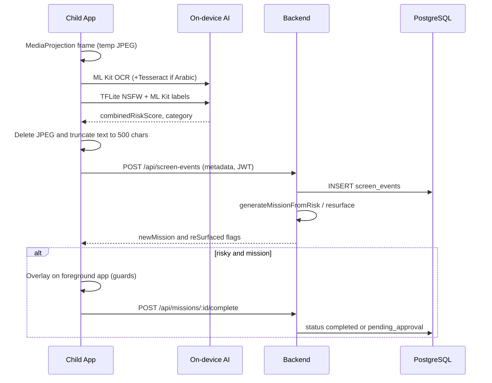

### 4.2 Daily scoring

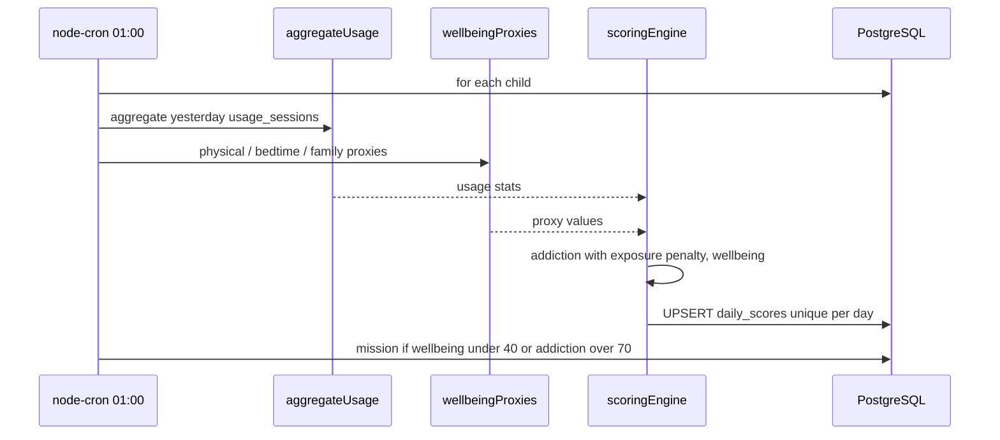

### 4.3 Parent approval

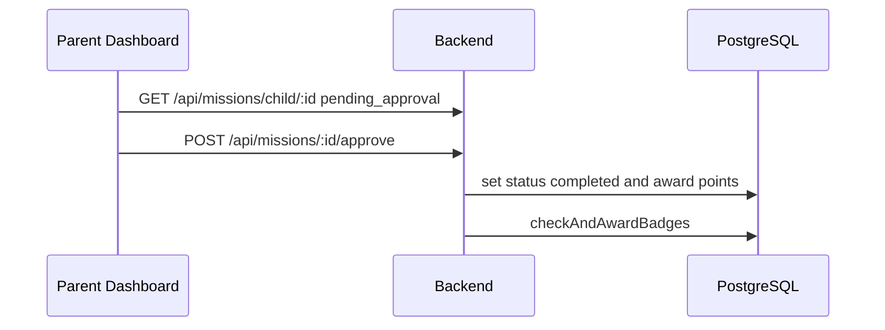

---

## 5. Data Model

16 sequential migrations (`000_init` … `016_blocked_domains`), applied by `db/migrate.ts` and tracked in a `schema_migrations` ledger.

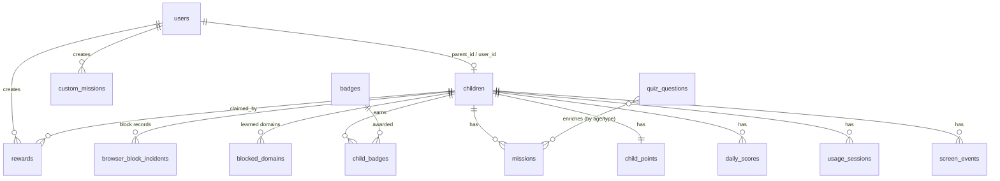

### 5.1 Core tables

| Table | Key columns | Notes |
|-------|-------------|-------|
| `users` | `id`, `email`, `role` (`parent`/`child`), `password_hash` | Role-checked |
| `children` | `id`, `user_id` (unique), `parent_id`, `display_name`, `birth_year`, `interests` JSONB | `interests` added in `014` |
| `screen_events` | `child_id`, `timestamp`, `app_package`, `extracted_text_preview` (≤500), `risk_flag`, `risk_score`, `category`, vision fields | No images; vision fields added in `005` |
| `usage_sessions` | `child_id`, `start_time`, `end_time`, `app_package`, `app_category` | Range-checked; feeds scoring |
| `daily_scores` | `child_id`, `score_date`, `addiction_score`, `wellbeing_score`, 10 component columns | `UNIQUE (child_id, score_date)` |
| `missions` | `child_id`, `title`, `points`, `status`, `trigger_reason`, `metadata` JSONB, `expires_at`, `penalty_applied`, `escaped_at` | Status set extended in `010` |
| `rewards` | `parent_id`, `points_required`, `is_claimed`, `claimed_by_child_id` | Parent catalogue |
| `custom_missions` | `parent_id`, `title`, `points`, `is_active` | Added in `012` |
| `badges` / `child_badges` | `requirement_type`, `requirement_value`/`requirement_config` | Tiers in `008`; cleanup in `015` |
| `child_points` | `child_id`, `total_points` | Level = `floor(points/500)+1` |
| `quiz_questions` | `quiz_type`, `options`, `correct_answer_index`, `age_min/max` | Added in `011`, extended `013`; 22 questions (safety 5, conflict 5, empathy 4, media_violence 8) |
| `blocked_domains` | `child_id`, `domain` (host, ≤253), `source` (`detected`), `detected_at`, `removed_at` | `UNIQUE (child_id, domain)`; an unblock sets `removed_at`, a later detection reactivates the row. Added in `016` |
| `browser_block_incidents` | `child_id`, `domain`, `list_source` (`static`/`detected`), `occurred_at` | Append-only. Added in `016` |
| `schema_migrations` | `filename`, checksum, `applied_at` | Created by the runner itself |

### 5.2 Migration inventory

| # | File | Adds |
|---|------|------|
| 000 | `000_init.sql` | `pgcrypto`, `users`, `children` |
| 001 | `001_screen_events.sql` | `screen_events` |
| 002 | `002_dev_seed.sql` | Seeded parent/child for dev |
| 003 | `003_usage_sessions.sql` | `usage_sessions`, `daily_scores` |
| 005 | `005_add_tflite_risk.sql` | Vision fields on `screen_events` |
| 006 | `006_add_app_label.sql` | `app_label` |
| 007 | `007_missions_gamification.sql` | `missions`, `rewards`, `badges`, `child_badges`, `child_points` |
| 008 | `008_add_smart_badges.sql` | Point/mission/age badge tiers |
| 009 | `009_add_screen_events_child_created_idx.sql` | Index for cumulative-burst query |
| 010 | `010_parent_approval_escape.sql` | `pending_approval`/`failed` statuses, penalty columns |
| 011 | `011_quiz_questions.sql` | `quiz_questions` |
| 012 | `012_custom_missions.sql` | `custom_missions` |
| 013 | `013_quiz_media_violence.sql` | Media-violence quiz seeds |
| 014 | `014_child_interests.sql` | `children.interests` JSONB |
| 015 | `015_badge_cleanup.sql` | Remove legacy duplicate badges |
| 016 | `016_blocked_domains.sql` | `blocked_domains`, `browser_block_incidents` |

> Note: there is no `004`; numbering skips it (historical). The runner applies files in lexical order, each once, in its own transaction with its ledger row; editing an applied file is refused by checksum, and a pre-ledger database already at head is baselined without executing anything.

---

## 6. API Surface

Registered in `backend/src/routes/index.ts`. `/health` is public; `/dev/*` and `/debug/*` are mounted **only when not production**; everything else requires `Authorization: Bearer <JWT>`. Every route scoped to a `childId` additionally enforces parent→child ownership via `requireChildAccess` / `userCanAccessChild` (`backend/src/middleware/childAccess.ts`), guarded by an enumeration test (`backend/tests/routeAuthorization.test.ts`) that reds when a child-scoped route ships without it.

| Method | Path | Role | Purpose |
|--------|------|------|---------|
| GET | `/api/health` | Public | Liveness |
| GET | `/api/dev/child-token` / `parent-token` | Dev | Mint JWT (7-day) |
| POST | `/api/debug/classify` / `arabic-ocr` | Dev | Server-side vision/OCR validation |
| POST | `/api/screen-events` | Child | Ingest event; trigger mission |
| GET | `/api/screen-events/:childId` | Parent | List events |
| POST | `/api/usage` | Child | Batch sessions |
| GET | `/api/usage/:childId` | Parent | Sessions for a day |
| GET | `/api/scores/:childId` | Parent | Latest/dated scores + level |
| GET | `/api/scores/:childId/trend` | Parent | N-day trend |
| POST | `/api/missions/suggest` / `generate` | Child / Dev | Create mission |
| GET | `/api/missions/child/:childId` | Child/Parent | List by status |
| POST | `/api/missions/:id/complete` | Child | Complete (real_world→approval) |
| POST | `/api/missions/:id/approve` / `reject` | Parent | Approval workflow |
| POST | `/api/missions/:id/abandon` | Child | Escape penalty |
| GET/POST/PUT/DELETE | `/api/rewards` (+`/:id/claim`) | Parent/Child | Rewards |
| GET | `/api/badges` (+`/child/:childId`) | Any/Child+Parent | Badges |
| POST | `/api/bonus/child/:childId` | Parent | Bonus points |
| GET/POST/PUT/DELETE | `/api/custom-missions` | Parent | Custom missions |
| GET/PUT | `/api/child/profile` / `interests` | Parent | Profile + interests |
| POST | `/api/blocked-domains` | Child | Record a learned domain (host only; child id from the token) |
| GET | `/api/blocked-domains/:childId` | Child / Parent | Active learned domains (the device reads it back to reconcile) |
| POST | `/api/blocked-domains/dev/unblock` | Dev (parent) | Remove a learned domain; flat 404 in production |
| POST | `/api/browser-incidents` | Child | Record a block incident |
| GET | `/api/browser-incidents/:childId` | Parent | Incident history |
| POST | `/api/missions/dev/force` | Dev (parent) | Force a specific mission template for a demo; flat 404 in production |

Full per-route detail for the mission and gamification routes:

| Method | Path | Role | Purpose |
|--------|------|------|---------|
| POST | `/api/missions/suggest` | Child | Mobile compat — create mission from category (score defaults to 75) |
| POST | `/api/missions/generate` | Dev | Manual trigger (non-production) |
| GET | `/api/missions/child/:childId` | Child / Parent | List `pending`, `pendingApproval`, `completed`, `expired`, `failed` |
| GET | `/api/missions/child/:childId/points` | Child / Parent | Total points |
| POST | `/api/missions/:missionId/complete` | Child | Complete mission (`real_world` → `pending_approval`) |
| POST | `/api/missions/:missionId/approve` | Parent | Approve real-world mission, award points |
| POST | `/api/missions/:missionId/reject` | Parent | Reject pending approval → `expired` |
| POST | `/api/missions/:missionId/abandon` | Child | Escape penalty (−10 pts, `failed`) |
| POST | `/api/bonus/child/:childId` | Parent | Award bonus points |
| GET / POST / PUT / DELETE | `/api/custom-missions` (+`/:id`) | Parent | Custom real-world missions |
| GET / POST / PUT / DELETE | `/api/rewards` (+`/:rewardId`) | Parent / Child | Rewards (child sees unclaimed only) |
| POST | `/api/rewards/:rewardId/claim` | Child | Spend points to claim |
| GET | `/api/badges` | Any | All badges; `?childId=` adds earned status |
| GET | `/api/badges/child/:childId` | Child / Parent | Earned badges |
| GET / PUT | `/api/child/profile/:childId` / `/api/child/profile` | Parent | Display name and `birth_year` (re-checks age badges) |
| GET / PUT | `/api/child/interests/:childId` / `/api/child/interests` | Parent | Interests (`sports`, `art`, `reading`, `family`, `brain`) |

### 6.1 Dev tokens and session handling

`GET /api/dev/child-token` and `/api/dev/parent-token` return signed JWTs for the seeded test users (`expiresIn: '7d'`, seed in `002_dev_seed.sql`). They are registered only when `NODE_ENV` is not `production`. On the device, `useDevChildToken` stores the child token in AsyncStorage via `tokenStorage`.

| Trigger | Behaviour (mobile) |
|---------|-----------|
| Stored JWT has past `exp` | Cleared on startup; a fresh `/api/dev/child-token` is fetched automatically |
| API returns **401** | `apiClient` clears AsyncStorage and requests a session refresh (no redbox during capture) |
| Profile → **Log out / refresh JWT** | Clears stored JWT + child id, then forces the same refresh path so monitoring can resume |

Implementation: `MobileApp/src/auth/useDevChildToken.ts`, `authSession.ts`, `jwtUtils.ts` (`isJwtExpired`), `services/apiClient.ts`, `ProfileScreen.tsx`.

### 6.2 Example payloads

`POST /api/screen-events` (child):

```json
{
  "timestamp": "2026-05-17T18:30:00.000Z",
  "appPackage": "com.instagram.android",
  "extractedTextPreview": "Sample OCR text from screen...",
  "riskFlag": true,
  "riskScore": 72,
  "imageRiskScore": 81,
  "combinedRiskScore": 78,
  "imageClassificationDetails": {
    "source": "mlkit",
    "violenceScore": 0.12,
    "imageRiskScore": 81
  },
  "category": "violent"
}
```

`imageClassificationDetails` is a fixed schema-bounded object — named fields only (classifier scores + model-label vocabulary), every string length-capped, unknown keys stripped and logged server-side (`backend/src/validators/screenEvents.validator.ts`). `mockHint` is accepted for backward compatibility but not stored. Response: `201 Created` with the stored event, plus `newMission` when a mission is created or **re-surfaced** (`missionGeneration` explains skips such as `cooldown_active`).

`POST /api/usage` (child) — batch of foreground sessions, response `{ "count": 1 }`:

```json
{
  "sessions": [
    {
      "startTime": "2026-05-17T10:00:00.000Z",
      "endTime": "2026-05-17T10:15:00.000Z",
      "appPackage": "com.android.chrome",
      "appCategory": "browser_social"
    }
  ]
}
```

`GET /api/usage/:childId?date=YYYY-MM-DD` returns raw sessions for a day (default today). `GET /api/scores/:childId?date=` returns addiction and well-being scores (latest if no date) plus `totalPoints` and `level` (`floor(totalPoints / 500) + 1`); the stored addiction score includes the weekly exposure penalty (see [scoring_formulas.md](scoring_formulas.md)). `GET /api/scores/:childId/trend?days=7` returns 1–90 days.

The mobile app collects usage with `useRealForegroundTracker` (app root): it polls the foreground package every **5 s** while monitoring is active and batches `POST /api/usage` every **60 s**.

---

## 7. On-Device AI Pipeline

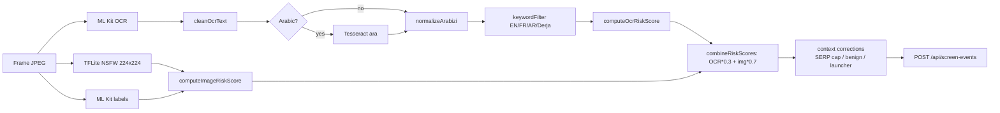

**Design rationale.** OCR runs strictly before the optional Tesseract pass to avoid ML Kit/Tesseract concurrency and to keep non-Arabic frames fast. Vision uses a lightweight, RN-0.74-compatible NSFW model rather than an on-device multi-head network. Context correctors (`riskySearchContext`, `benignRiskContext`, `launcherCaptureContext`) reduce false positives from filtered SERPs, social inboxes, and launcher thumbnails.

Full formulas are in [scoring_formulas.md](scoring_formulas.md).

**Limit of the vision model.** Yahoo Open NSFW sees the whole screen shrunk to 224×224, so an explicit image that fills the screen scores high (observed raw 0.73–0.98), while a landing page made of many small thumbnails scores low (observed 0.007–0.505, typically 0.02–0.27) and drawn content scores about 0. There is no labelled test set, so no accuracy figure is claimed.

### 7.1 OCR layers

| Layer | File | Responsibility |
|-------|------|----------------|
| Primary OCR | `MobileApp/src/services/mixedScriptOcr.ts` | ML Kit `TextRecognition.recognize` (fast path, FR/EN/Arabizi) |
| UI noise filter | `MobileApp/src/utils/cleanOcrText.ts` | Strips timestamps, like counts (`308K`), social UI strings |
| Script detection | `MobileApp/src/utils/normalizeArabizi.ts` | `containsArabicScript` + Arabizi gating (≥2 transformation digits, UI number exclusion) |
| Arabizi normalization | `normalizeArabizi(text)` | Digit/digraph mapping for Derja keyword matching |
| Arabic fallback (Android) | `MobileApp/src/services/mobileArabicOcr.ts` | `@devinikhiya/react-native-tesseractocr` + `ara.traineddata` (lazy init, single-flight, sequential fallback only when Arabic is detected; if a recognition never settles, Arabic OCR disables itself for that monitoring session and ML Kit continues) |
| Multilingual keyword filter | `MobileApp/src/utils/keywordFilter.ts` | EN / FR / AR / Derja lists; `keywordFilter(text, normalizedText?)` |

ML Kit runs first on every frame. Tesseract (`ara`) runs **after** ML Kit only when `arabicOcrTrigger.ts` detects Arabic script or garbled Latin from Arabic pages — not on English-dominant screens. If Tesseract hallucinates Arabic over substantial Latin ML Kit text, the pipeline keeps the ML Kit output. Messaging apps skip Tesseract unless ML Kit already saw Arabic Unicode. On-device Tesseract may still produce spacing/diacritic noise on low-resolution screenshots; keyword filtering tolerates short OCR artefacts.

**Debug only (server, supervisor validation):** `POST /api/debug/classify` (nsfwjs + Tesseract `eng`) and `POST /api/debug/arabic-ocr` (Tesseract `ara`, 1600 px upscale, synced keyword filter). The dashboard's debug tools upload a screenshot to these; images leave the device **only** in this debug tool, the endpoints are absent in production, and their scores are not the on-device scores.

### 7.2 Vision

OCR and image classification run on every processed frame: native `NsfwTflite` (Yahoo Open NSFW, 224×224, model at `MobileApp/android/app/src/main/assets/models/nsfw.tflite`) gives `adultScore` / `tfliteOutputs`, and ML Kit Image Labeling contributes violence / gore / educational cues; `riskCombination.ts` then computes `combinedRiskScore = OCR×0.3 + image×0.7`. A rebuild is required after model changes. In `__DEV__`, the **NSFW TFLite debug** panel re-classifies the last capture. Model notes: [MobileApp/assets/models/README.md](../MobileApp/assets/models/README.md). Verify stored vision fields with:

```sql
SELECT timestamp, image_risk_score, combined_risk_score, category,
       image_classification_json->>'source' AS classifier
FROM screen_events ORDER BY timestamp DESC LIMIT 10;
```

### 7.3 Adaptive capture

Capture frequency is risk-based rather than fixed.

| Trigger | When it fires |
|---------|----------------|
| **App switch** | Accessibility window events when the SafeGuard accessibility service is connected (near-instant); otherwise the fallback UsageStats poll every 1 s. Also on `AppState` background (leaving SafeGuard) |
| **Follow-up** | 5 s after an app switch, unless a capture completed within the last 2 s |
| **Periodic** | Rolling average of the last 3 `combinedRiskScore` values sets the interval |
| **Scroll settle** | Once a scroll burst has been quiet for 2 s (cooldown `max(10 s, periodic interval)`) |
| **Keyboard suppression** | While the soft keyboard is visible, only the routine reasons (periodic, content change, scroll settle) are dropped; app switches and follow-ups still capture |

| Average risk (last 3) | Periodic interval |
|-----------------------|-------------------|
| > 70 | 10 s |
| 30 – 70 | 15 s |
| < 30 | 20 s |

Ordering invariant: HIGH ≤ MEDIUM ≤ LOW. The interval is then adjusted by foreground app category (`appCapturePolicy.ts`):

| App category | Examples | Effective periodic interval |
|--------------|----------|----------------------------|
| `browser_social` | Chrome, Instagram, TikTok, YouTube, WhatsApp, Facebook | `min(risk base, 15 s)` |
| `game` | Roblox, Minecraft, Clash of Clans | 0 (app-switch + follow-up only) |
| `education` | Khan Academy, Duolingo | `max(risk base, 120 s)` |
| `system` | Stock launchers | 0 |
| `default` | Other apps | risk base unchanged |

**One native clock.** The native capture loop emits a tick every 5 s from a `Handler.postDelayed` loop kept alive by the `mediaProjection` foreground service; `useScreenshotCapture` subsamples it to the effective interval (5 s divides 10/15/20/120 exactly), and every capture reason goes through one capture coordinator (`captureCoordinator.ts`) that owns the 5 s debounce, mission pause, keyboard suppression and priority coalescing. A native perceptual hash skips frames that have not visibly changed (always bypassed on an app switch; forced again after 90 s).

**Accessibility-driven app switches.** While the accessibility service is *driving* (connected and a window event seen within 60 s), the UsageStats poll keeps running only for its foreground-cache writes; if the service is off or silent for 60 s, the poll is the fallback. `windowEventFilter.ts` collapses the raw feed, rejecting SafeGuard's own window → keyboard (IME) packages → same package → launcher settling (1.5 s; the launcher ↔ Google search surface flap yields one capture). The keyboard latch is cleared on accessibility disconnect and on stop. Package names and booleans only are taken from these events; the only node ever read is Chrome's address bar (see §7.4).

**Foreground attribution.** `resolveForegroundAppWithRetry()` queries UsageStats (events window 120 s, `queryUsageStats` fallback limited to apps used in the last 5 s; three attempts 200 ms apart in the foreground, one attempt when backgrounded). The native query is bounded at 2.5 s; a lookup stuck past 2.5 s is abandoned and the frame is attributed `unknown` while OCR continues. The 1 s poll cache is used only when younger than 30 s; `com.android.systemui` and launcher packages are never reported, and `inferAppPackageFromOcr` overrides MIUI/SafeGuard mis-attribution for Messenger/Chrome/WhatsApp.

**Context rules.** Messenger/WhatsApp home-inbox OCR is scored neutral unless explicit adult URLs appear. When the foreground is the home launcher and OCR is only a recents-widget thumbnail, the event is stored neutral. On Google/Bing/DuckDuckGo pages with SafeSearch / Mode IA / blur UI and TFLite < 30, combined risk is capped (~24) unless the search box itself shows an explicit query (`Q porn`, `+ Q nsfw`, or a keyword hit); body-only keywords in result titles do not bypass the cap; on Mode IA pages `benignRiskContext` keeps search-box keyword hits and drops body-only noise. `benignRiskContext` also filters `nsfw` / `adult` on SafeSearch / Fiverr parental UI and on OCR of the parent dashboard, and `riskySearchContext` boosts `nsfw` / `adult` when OCR shows an explicit query on a Google/Bing/DuckDuckGo search URL (both wired on mobile and backend).

**Post-mission capture.** When a blocking mission ends, the foreground package snapshotted on pause may be reused for 120 s if UsageStats briefly returns `unknown`; `resumeCapture` also refreshes the foreground cache. The overlay is shown **before** capture pauses so MIUI does not attribute the frame to SafeGuard.

**Practical notes.** Very fast app switches inside the 5 s debounce may delay the frame until the follow-up or periodic capture (~5–20 s). Blank or loading Chrome tabs (empty page, incognito, DRM) often produce neutral scores — wait for the page to load. Usage access is optional but improves `appPackage` / `appLabel` accuracy. A rebuild is required after native `ForegroundAppModule` / `SafeGuardAccessibilityService` changes.

Implementation: `MobileApp/src/hooks/useScreenshotCapture.ts`, `src/capture/captureCoordinator.ts`, `src/capture/windowEventFilter.ts`, `src/hooks/useAccessibilityEvents.ts`, `src/native/SafeGuardAccessibility.ts`, `src/utils/adaptiveCapture.ts`, `src/utils/appCapturePolicy.ts`, `src/native/ForegroundApp.ts`, native `ForegroundAppModule`, `SafeGuardAccessibilityService` and `ScreenCaptureModule.captureNow()`.

### 7.4 Adult-site blocking (Chrome)

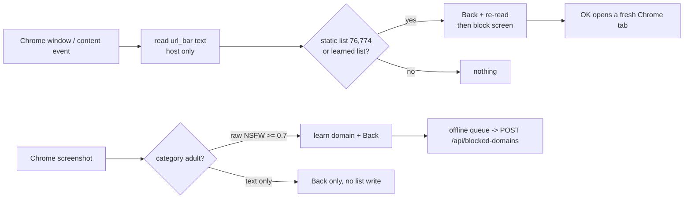

- **Known domain:** the accessibility service reads only Chrome's `com.android.chrome:id/url_bar` (its text and focus flag), for Chrome events only. A focused bar is never read as a host. `HostNormalizer` keeps the lowercased host and drops scheme, user info, port, path, query and fragment. A listed host is answered with Back about 130 ms after the address-bar event, a re-read, a second Back and HOME if needed, then a full-screen block screen; its OK opens a fresh blank Chrome tab (the launch runs before the overlay is removed, because Android only allows that background launch while the overlay is visible). The previous tab stays in Chrome's tab list; returning to it blocks again.
- **Learned domain:** a Chrome screenshot classified `adult` with raw NSFW ≥ 0.7 adds its registrable domain to an on-device list, provided the capture is ≤ 30 s old and taken on that same Chrome host (a frame captured after Chrome left is never blamed on it). A repeat visit is then blocked in 117–160 ms. An `adult` result from text alone presses Back once, with no list write and no incident.
- **Never-block list:** search engines and major platforms are never blocked; on shared-hosting suffixes (e.g. `blogspot.com`, `github.io`) only the exact subdomain is stored.
- **Sync:** learned domains are queued offline and posted to `/api/blocked-domains`; a one-time backfill uploads what the device already learned; on each monitoring start the device reads the server list back and replaces its learned list (so a dev-side unblock takes effect). A failed server read leaves the device list untouched. Each block emits an incident `{host, listSource, timestamp}` posted to `/api/browser-incidents` (best effort, not queued).
- **Limits:** Chrome only (other browsers, VPNs and private DNS bypass it); the lists load in the background after the service connects, and nothing is blocked during that time (under a second); incognito frames are black, so first-visit detection cannot work there, while listed domains still block; the OS can stop the accessibility service (see [deployment.md](deployment.md) §7.3).

---

## 8. Backend Internals

### 8.1 Mission decision tree (`pickMissionTemplate`)

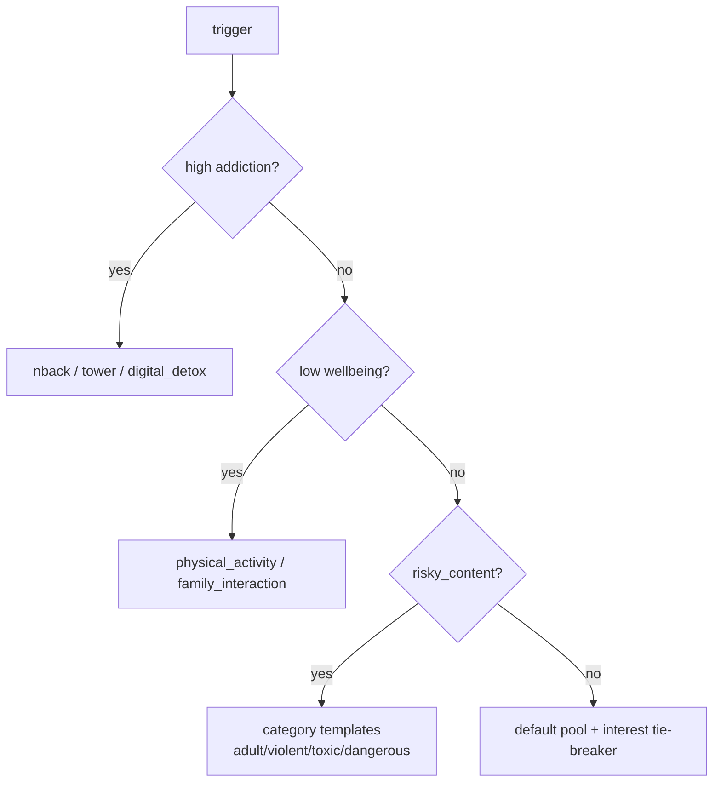

### 8.2 Cooldown & resurface state machine

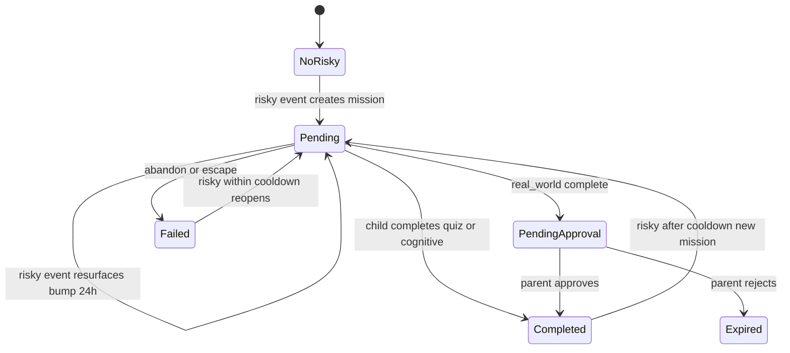

`pending_approval` does **not** count toward the 3-pending limit and does **not** block a new risky mission. `failed` (abandoned) within the cooldown window blocks new creation and triggers a re-surface of the same mission.

### 8.3 Mission rules reference

All gamification `child_id` values reference `children.id` (the JWT `childId`), not `users.id`.

| Trigger | Condition | Source |
|---------|-----------|--------|
| Risky content (single) | `combinedRiskScore > adaptiveThreshold` (7-day avg + 10, clamped 50–80; 50 for a new child) | `POST /api/screen-events` → `generateMissionFromRisk` |
| Risky content (cumulative) | Sum of the last 5 scores in 30 min > 300 (at least 3 events) | Same path — lets moderate singles trigger via a burst |
| Low wellbeing | `wellbeingScore < 40` | Daily cron |
| High addiction | `addictionScore > 70` | Daily cron |
| Mobile suggest | `POST /api/missions/suggest` | Same rules as risky content (score defaults to 75) |

`POST /api/screen-events` calls `generateMissionFromRisk` for **every** event with a combined score, so the burst rule can fire below the adaptive threshold. Skip reasons: `below_risk_threshold`, `cooldown_active`, `pending_limit_reached`.

| Rule | Behaviour |
|------|-----------|
| **Cooldown** | A new risky-content mission is blocked while a **pending** risky mission exists or one was **escaped/abandoned (failed)** within `MISSION_RISK_COOLDOWN_MINUTES` (15 min; 2 min in development). In both cases a further risky capture re-surfaces the same mission (`reSurfaced: true`; failed ones are re-opened to pending) rather than creating a new one |
| **Re-surface bump** | `expires_at` extended by 24 h; points +5, capped at +50 % of the base value |
| **Pending limit** | Max 3 `pending` missions per child; `pending_approval` does not count; on the limit, an existing pending mission is re-surfaced |
| **Expiry** | 24 h |
| **Escalation** | After every 3 `risky_content` missions in 24 h, +30 % points per level (max +60 % at level 2) |
| **Age** | `children.birth_year` adapts template difficulty |
| **Category pools** | `adult` → safety quiz, conflict quiz, tic-tac-toe, digital detox, relationships; `violent`/`gore` → media-violence quiz, conflict quiz, kindness, tic-tac-toe; `toxic` → positive communication, empathy quiz; `dangerous` → safety talk, parent discussion; other → safety quiz, tic-tac-toe. N-back is not in the adult or violent pools; it stays in the high-addiction pool (N-back, Tower of Hanoi, digital detox) |
| **Priority** | Addiction and wellbeing triggers take priority over category mapping; parent-selected interests break ties; parents' active custom missions join the real-world pools |

Index `009_add_screen_events_child_created_idx.sql` (`screen_events (child_id, created_at DESC)`) backs the burst query.

**Mission types and completion.**

| Type | Examples | Completion |
|------|----------|------------|
| `real_world` | Jumping jacks, family board game, screen-free break | `{ confirmed: true }` → `pending_approval`; points on parent approval |
| `quiz` | Online safety / conflict / empathy / media-violence | `{ answers }`; pass at ≥ 2/3 correct, points proportional to correct answers (25 % on a fail) |
| `minigame` | Tic-tac-toe, mini Sudoku 4×4 | Tic-Tac-Toe sends `finalBoard` + `moveSequence`; the server replays the moves and accepts a legitimately finished board (win, loss or draw); a fabricated board earns 0. Sudoku: `{ won: true }` or `{ completed: true }` |
| `cognitive` | N-back, reaction time, Tower of Hanoi | `{ exerciseScore }`, `{ reactionTimeMs }`, `{ moves }`; N-back proportional to % correct, reaction ≤ 300 ms full points, Hanoi optimal 7 moves = base + 10 |

**Playable games (6).** Quiz and Tic-Tac-Toe play inside the overlay, and real-world missions are confirmed there; Sudoku, N-back, Reaction and Tower of Hanoi open in the app (`MissionScreen`).

| Game | Component | Notes |
|------|-----------|-------|
| Tic-Tac-Toe | `TicTacToeGame.tsx` / `OverlayTicTacToeHelper.java` | Child = X. In the app the AI is `easy` / `medium` / `hard` (minimax) by age and past results; in the overlay it plays `medium` (win, block, centre) |
| Quiz | `QuizScreen.tsx` / `OverlayQuizHelper.java` | One question at a time; questions from `metadata.questions` (from the database), `quizBank.ts` only as a fallback; the overlay colours each answer right/wrong at once |
| Mini Sudoku 4×4 | `SudokuGame.tsx` | Pre-validated solutions; clues by difficulty (10 / 8 / 6) |
| N-back | `NBackGame.tsx` | 20 trials, 1.8 s/step; level rises after ≥ 80 % |
| Reaction time | `ReactionGame.tsx` | Grey → green after a random delay; "too soon" guard; average of 3 |
| Tower of Hanoi | `TowerOfHanoiGame.tsx` | Tap-to-select pegs with legality checks; bonus for 7 moves |

Pure game logic: `MobileApp/src/missions/games/gameLogic.ts`. Smart difficulty: age baseline (`<10` easy, `≥13` hard) plus an on-device performance store (`gameStats.ts`, AsyncStorage).

**Quiz bank.** Table `quiz_questions` (`011`, `013`) with types `safety`, `media_violence`, `conflict`, `empathy`, filtered by `age_min`/`age_max`; `quizService.getRandomQuestions` + `enrichQuizMetadata` attach questions at generation time. 22 questions: safety 5, conflict 5, empathy 4, media_violence 8. Add one with:

```sql
INSERT INTO quiz_questions (quiz_type, question_text, options, correct_answer_index, age_min, age_max)
VALUES ('safety', 'Your question?', ARRAY['Wrong', 'Correct', 'Wrong2', 'Wrong3'], 1, 6, 12);
```

**Child app behaviour.** Bottom tabs: Monitor, Missions, Rewards, Badges, Profile. A blocking `MissionScreen` opens on a high-risk capture or when the child opens an active mission. Home / app switch during an active mission after a 3 s grace → `POST .../abandon`, −10 points; force-closing the app does not trigger a penalty. Without "Display over other apps", a high-priority notification opens `MissionScreen` when the child returns to SafeGuard. Points refresh on focus / pull-to-refresh, with an optional 60 s poll on Missions and Profile.

**Overlay presentation.** The same pending mission is not re-shown within 90 s; a re-surfaced mission uses a 60 s minimum gap; re-surfaced missions are suppressed for 8 s after monitoring starts and for 2 min after the child dismisses one; a 10 s post-mission grace stops a second overlay stacking. Overlays are skipped when the foreground is a launcher. The backend does not re-surface `pending_approval` or completed real-world missions.

**Capture lease.** While a mission is on screen, capture is paused under a single lease. In the app, a 60 s heartbeat keeps it alive; for the overlay, the app asks the native side whether the overlay is still showing. A lease with no proof of life for 10 min is released, and every lease is released after 1 h regardless.

### 8.4 Badges

| Category | `requirement_type` | Examples | How earned |
|----------|-------------------|----------|------------|
| Point badges | `total_points` | Rising Star (100), Explorer (500), Legend (10,000) | Lifetime `child_points.total_points` threshold |
| Mission badges | `missions_completed` | First Steps (1), Helper (10), Guardian Angel (500) | Count of completed missions |
| Age badges | `age_range` | Little Explorer (6–9), Young Adventurer (10–12), Teen Champion (13–17) | From `children.birth_year` on `checkAndAwardBadges` |
| Special badges | `wellbeing_score_streak`, `cognitive_exercises_done`, `trigger_reason_count` | Well-being Warrior, Brain Trainer, Risk Buster | Earlier rules, kept |

Age ranges live in `badges.requirement_config` JSONB (`{"min":10,"max":12}`). Only one age badge per child is kept — `PUT /api/child/profile` revokes mismatched bands (and deducts their bonus points) before re-awarding. `008_add_smart_badges.sql` adds the tiers; `015_badge_cleanup.sql` removes the legacy duplicates (`First Mission`, `Mission Master`, superseded by First Steps / Helper) and cleans mismatched `child_badges`. The parent **Badge ranks** view and the child app's **Ranks** action show all tiers with progress bars.

### 8.5 Timers reference

| Timer | Value | What it controls |
|-------|-------|------------------|
| Risky mission cooldown | While a pending risky mission exists, or 15 min after an escape (2 min in development) | Blocks a *new* risky-content mission; events are still stored; the existing mission is re-surfaced |
| Pending mission limit | Max 3 `pending` | `pending_approval` does not count |
| New-mission overlay debounce | 90 s | Same mission id not re-shown |
| Re-surface overlay debounce | 60 s | Minimum gap between re-surfaced overlays for the same mission |
| Startup grace | 8 s | After monitoring starts, re-surfaced overlays are suppressed |
| Dismissed re-surface block | 2 min | After the child dismisses a re-surfaced overlay |
| Capture debounce | 5 s | Minimum gap between captures (do not lower casually — OCR load) |
| App-switch follow-up | 5 s (skipped if a capture < 2 s ago) | Extra capture after an app switch |
| Post-mission present grace | 10 s | After a mission ends, no new mission is presented (risk still posted) |
| Native tick | 5 s | Single native clock; JS subsamples it |
| Periodic capture | 10 / 15 / 20 s by risk (+ app category) | Re-scan while staying in an app |
| OCR lock takeover | 8 s | Newest frame takes over if OCR is stuck |
| Foreground lookup | 2.5 s | Native bound and wall-clock abandon of a wedged UsageStats lookup |
| Vision / processing watchdog | ~25 s | In-frame; foreground only |
| Tick-liveness backstop | 60 s | Native-tick recovery of a wedged frame; works backgrounded while the screen is on |
| Per-phase deadline | `foreground_lookup` 10 s, `api_post` 20 s, `vision` none | Faster native-tick recovery for those phases |
| Post-mission foreground grace | 120 s | Reuse the pre-mission package if UsageStats is briefly unknown |
| Mission abandon grace | 3 s | Leaving `MissionScreen` in the first 3 s is not an escape |
| Mission capture lease | 60 s heartbeat, 10 min soft limit, 1 h hard ceiling | Capture pause while a mission is shown |
| Dev JWT lifetime | 7 days | Auto-refresh on expiry / 401 / Profile logout |

---

## 9. Deployment View

### 9.1 Development topology

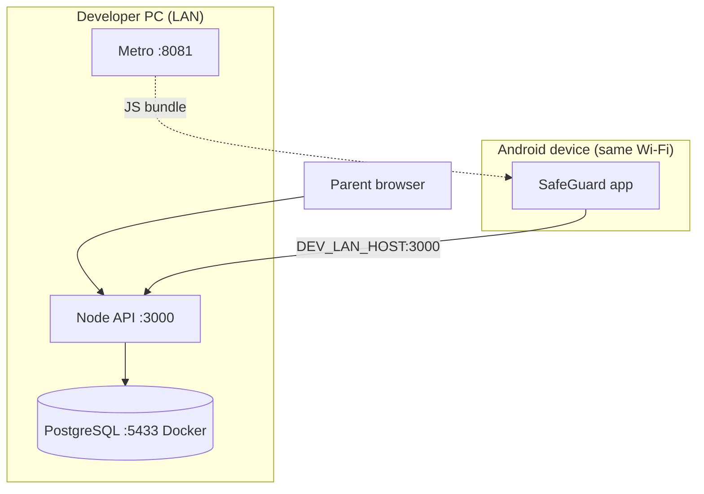

- Emulator uses `10.0.2.2:3000`; a physical device uses `DEV_LAN_HOST` from `apiConfig.ts`.
- PostgreSQL runs in Docker on host port **5433** (avoids clashing with a local PG).

### 9.2 Production topology (recommended)

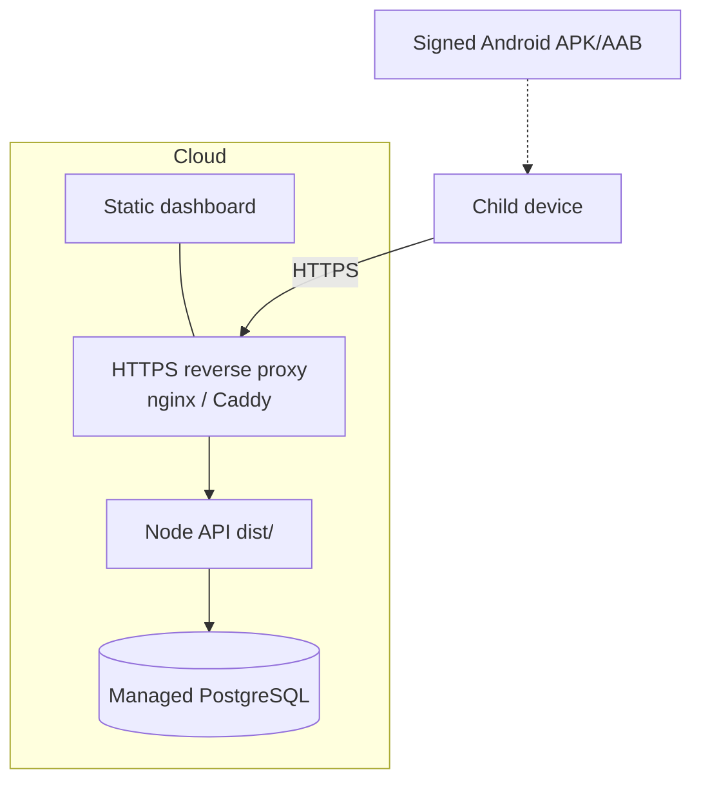

Production notes: build with `npm run build` and serve `dist/`; set `NODE_ENV=production` (disables `/dev` + `/debug`); terminate TLS at a proxy; use a managed PostgreSQL with backups. Full steps in [deployment.md](deployment.md).

---

## 10. Cross-Cutting Concerns

| Concern | Approach |
|---------|----------|
| **Privacy** | On-device AI; images never leave the device (release builds delete the screenshot file right after processing; debug builds keep it in the app's private storage for inspection). The backend receives exactly: text previews (≤ 500 chars), scores and categories, the host of a learned adult domain, and browser block incidents (host, list source, time). The address-bar read keeps only the host; the full URL and path are never stored or sent. The text preview (≤500 chars) is OCR of whatever is visible on screen, so it can include any text shown there, including a web address. That preview is what reaches the backend. In all builds, the first 80 characters of the preview are also written to the device's local log (logcat). It stays on the phone and other apps can't read it. Debug image endpoints are dev-only |
| **Security** | JWT gate on `/api/*`; Helmet + CORS; Joi validation; env-provided secrets |
| **Reliability** | Layered wedged-frame recovery from one native 5 s tick (see §10.1); idempotent score upsert. Screen-off freezes the RN JS thread, so JS-side backstops recover a locked-phone wedge only on screen wake. |
| **Observability** | Structured JSON logs (backend), Metro `[ScreenCapture]` logs (mobile) |
| **Performance** | Adaptive capture, 25 s vision budget, 5 s debounce, Arabic Tesseract gating |
| **Config** | `backend/.env` (env), `MobileApp/src/config/apiConfig.ts` (LAN host) |
| **i18n of risk** | Parallel EN/FR/AR/Derja keyword lists on mobile and backend |
| **Time zone** | `APP_TIMEZONE` (default Africa/Tunis) sets score-day boundaries, the night window and the cron fire time |

### 10.1 Wedged-frame recovery

A frame that hangs in `processCapturedFrame` (a native OCR / UsageStats / API promise that never settles) would otherwise hold the OCR lock and stop monitoring; the in-frame 25 s watchdog and 5 s heartbeat are JS timers and are frozen while SafeGuard is backgrounded. Recovery is layered and driven from the native 5 s tick (`decideTickAction`, pure):

| Guard | Trigger | Notes |
|-------|---------|-------|
| Tick-liveness backstop | OCR lock held past 60 s | `forceReleaseProcessingLock('tick-liveness')`. Survives backgrounding, but only while the screen is on |
| Per-phase deadline | `foreground_lookup` > 10 s, `api_post` > 20 s | `tick-phase-timeout:<phase>`. `vision` has no phase deadline and rides the 60 s backstop |
| In-frame watchdog / heartbeat | 25 s / hung native call | Foreground only |
| OCR-lock takeover | new frame arrives, lock held > 8 s | Newest frame takes over |
| Generation token | every lock acquire | A superseded frame's late `finally` / watchdog / heartbeat becomes a no-op and cannot reset the active frame's state |

OCR + TFLite are capped at 25 s per frame (`vision_timeout` skip) when foregrounded.

---

## 11. Architectural Decisions (ADRs)

Condensed decision log. The v1.0-final rationale is in [archive/PREFINAL_REPORT.md](archive/PREFINAL_REPORT.md) §3 (historical snapshot).

| ADR | Decision | Rationale | Consequence |
|-----|----------|-----------|-------------|
| ADR-1 | On-device AI, metadata-only API | Privacy invariant (GDPR/COPPA alignment) | No cloud vision; model updates need app rebuild |
| ADR-2 | Yahoo Open NSFW TFLite over custom EfficientNet | RN 0.74 compatibility + stability | Binary-ish adult signal; training pipeline archived |
| ADR-3 | ML Kit first, Tesseract `ara` fallback | Speed on Latin, coverage on Arabic | Sequential pipeline; up to 25 s on Arabic frames |
| ADR-4 | OCR (30%) + vision (70%) weighting | Thumbnails/UI text carry strong signals | Keyword-heavy events; context correctors needed |
| ADR-5 | Adaptive + app-aware capture | Battery vs responsiveness | One native 5 s tick emits; JS subsamples to the effective interval and carries the wedged-frame backstops (the earlier dual native-loop + JS-timer model is retired) |
| ADR-6 | Overlay-before-pause presentation | MIUI mis-attribution fix | Requires SYSTEM_ALERT_WINDOW; notification fallback |
| ADR-7 | Cooldown + resurface (no spam) | Prevent bypass by completing then returning | More complex mission state machine |
| ADR-8 | Web dashboard, not native parent app | PFE iteration speed | Web-only parent experience; polling not push |
| ADR-9 | Sequential SQL migrations + `schema_migrations` ledger | Simplicity, reviewability | Runner applies each file once in its own transaction; re-run is a no-op, applied-file edits refused by checksum, pre-ledger DBs auto-baselined |
| ADR-10 | JWT dev tokens | Sufficient for demo | Per-route parent→child ownership is now enforced (`middleware/childAccess.ts` + enumeration test); real authentication / registration / token issuance is still missing — the only JWT source is the unauthenticated `/api/dev/*-token` |
| ADR-11 | Browser blocking via the Accessibility service rather than a VPN | A local VPN (`VpnService`) was considered and set aside: it would route all of the device's traffic through the app, which conflicts with the privacy design, and it needs its own permission. The Accessibility service was already used for app-switch events and can read Chrome's address bar, keeping only the host | Browser-layer, not network-layer: Chrome only, and other browsers, VPNs or private DNS bypass it; the service must be enabled by hand and the OS can stop it |
| ADR-12 | Native overlay games with server-side replay | Quiz and Tic-Tac-Toe can be played without leaving the app the child was using; the server cannot trust a client's claim of a win | Overlay UI written in Java alongside the RN screens; Tic-Tac-Toe completions carry the board and moves, and the server replays them before awarding points |

---

*End of architecture document — SafeGuard, Current `main` (post-Phase B, September 2026).*
