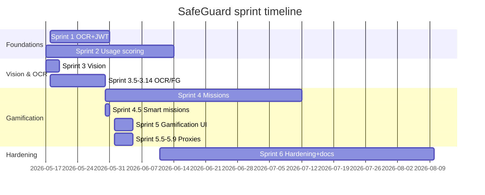

# Scrum Artefacts — SafeGuard AI Parental Control Platform

**Author:** Helmi Megdiche — ESPRIT (5th-year PFE)
**Repository:** [github.com/Helmi-Megdiche/PFE](https://github.com/Helmi-Megdiche/PFE)
**Document version:** 1.0 (final)
**Method:** solo-Scrum (single developer + academic/host supervisors as Product Owner proxies).

> This document records the agile process actually followed during the internship. Sprint boundaries, deliverables, and dates are cross-referenced with the Git commit history and the sprint table in [README.md](../README.md). It is written for the PFE jury as evidence of a disciplined, iterative delivery.

---

## Table of Contents

1. [Scrum Setup and Roles](#1-scrum-setup-and-roles)
2. [Product Vision and Goals](#2-product-vision-and-goals)
3. [Product Backlog (Epics)](#3-product-backlog-epics)
4. [Release Plan and Sprint Map](#4-release-plan-and-sprint-map)
5. [Sprint Details, Reviews, and Retrospectives](#5-sprint-details-reviews-and-retrospectives)
6. [Definition of Done](#6-definition-of-done)
7. [Metrics and Velocity](#7-metrics-and-velocity)
8. [Risk and Impediment Log](#8-risk-and-impediment-log)
9. [Overall Retrospective](#9-overall-retrospective)

---

## 1. Scrum Setup and Roles

| Role | Held by | Responsibility |
|------|---------|----------------|
| Product Owner (proxy) | Academic + host supervisors | Prioritise backlog from the two *cahiers des charges*, validate demos |
| Scrum Master (self) | Helmi Megdiche | Facilitate the process, remove impediments |
| Development Team | Helmi Megdiche | Design, implement, test, document |

- **Sprint length:** ~2 weeks for major sprints, with shorter interstitial "point" sprints (3.5, 4.5, 5.5, …) for focused hardening.
- **Ceremonies:** planning at sprint start, demo/review at sprint end (to supervisors), retrospective captured as notes, daily self-standup.
- **Artefacts:** product backlog (epics below), sprint backlogs (per-sprint scope), increment (working software each sprint), and this document.
- **Source of truth for "done":** the Git history — each sprint corresponds to one or more `feat(...)`/`fix(...)` commits.

---

## 2. Product Vision and Goals

> *For parents of children who face smartphone addiction and exposure to harmful content, SafeGuard is an intelligent parental-control layer that understands on-device screen activity, scores behavioural risk and wellbeing, and responds with gamified educational missions — without sending screenshots to the cloud.*

**Success criteria (PFE):**

1. A demonstrable end-to-end pipeline: capture → on-device AI → risk → mission → parent approval.
2. Privacy-preserving by construction (metadata-only API).
3. Multilingual detection (EN/FR/AR/Derja).
4. A tested, documented, reproducible milestone (`v1.0-final`).

---

## 3. Product Backlog (Epics)

| Epic | Description | Priority | Status |
|------|-------------|----------|--------|
| E1 — Screen capture & OCR | On-device capture, multilingual OCR, keyword filter | Must | Done |
| E2 — Usage scoring | Addiction + wellbeing daily scores, cron | Must | Done |
| E3 — Vision & combined risk | TFLite NSFW + ML Kit labels, combined risk | Must | Done |
| E4 — Foreground accuracy | UsageStats attribution + OCR override (MIUI) | Must | Done |
| E5 — Missions & gamification | Generation, games, points, badges, rewards | Must | Done |
| E6 — Smart missions | Adaptive threshold, burst, category mapping, escalation | Should | Done |
| E7 — Parent dashboard | Monitoring + parent control web UI | Must | Done (web) |
| E8 — Wellbeing proxies & interests | Dynamic proxies, interest personalization | Should | Done |
| E9 — Hardening & docs | Stability fixes, tests, final documentation | Must | Done |
| E10 — Integration/native parent app | Host-app integration, native parent app | Could | Not done (future work) |

---

## 4. Release Plan and Sprint Map

Two milestones: **`v1.0-final`** (feature-complete prototype, tag reference commit `59da85b`, 5 June 2026) and subsequent **pre-integration hardening** (through August 2026).

> Dates are approximate windows aligned with commit dates; interstitial sprints landed within the major windows.

---

## 5. Sprint Details, Reviews, and Retrospectives

Each sprint lists its **goal**, **key increment** (with representative commits), **review outcome**, and a short **retrospective** (Keep / Improve).

### Sprint 1 — Screen monitoring foundation (18–31 May 2026)

- **Goal:** on-device capture + OCR + JWT backend ingestion.
- **Increment:** MediaProjection capture, ML Kit OCR, keyword filter, `POST /api/screen-events`, JWT, `screen_events` table. Commits: `2373744` (sprint-1), `bb0c919` (README).
- **Review:** end-to-end capture → stored event demonstrated.
- **Retro:** *Keep* — on-device-first decision. *Improve* — background capture reliability (addressed in `e76399a`).

### Sprint 2 — Usage-based scoring + cron (1–14 June window; core `344fbcf`)

- **Goal:** behavioural scoring from real usage.
- **Increment:** `usage_sessions`, `daily_scores`, scoring engine (5+5 components), `node-cron` daily job, scores/trend APIs.
- **Review:** addiction/wellbeing scores computed and retrievable.
- **Retro:** *Keep* — pure, testable scoring functions. *Improve* — UTC vs local date boundaries (logged as limitation).

### Sprint 3 → 3.14 — Vision, OCR accuracy, foreground (17–30 May 2026)

- **Goal:** combined risk + multilingual OCR + accurate foreground attribution.
- **Increment (highlights):**
  - Vision + combined risk `OCR×0.3 + vision×0.7` (`e1aefcd`, `9201720`).
  - Yahoo Open NSFW TFLite on-device (`9d17a75`, `ef30544`).
  - Multilingual FR/AR/Derja + Arabizi normalization (`61ad486`, `69a0a55`).
  - On-device Arabic Tesseract with English-page skip and hallucination guard (`1e197c6`, `454e6b0`).
  - Foreground UsageStats window/retry/cache fixes (`cddf628`, `a38049e`).
- **Review:** demonstrated adult/violent detection across languages; MIUI attribution improved.
- **Retro:** *Keep* — sequential ML Kit→Tesseract to avoid concurrency. *Improve* — false positives on filtered SERP (addressed in Sprint 6 hardening).

### Sprint 3.7 — Adaptive capture (20 May 2026)

- **Goal:** replace fixed interval with risk-based scheduling.
- **Increment:** app-switch immediate capture, 5 s follow-up, 10/15/20 s tiers, debounce (`a468b76`, `c0115c2`).
- **Review:** faster reaction after risky browsing, lower idle cost.
- **Retro:** *Keep* — adaptive intervals. *Improve* — native-vs-JS timer interplay (documented; tuned later).

### Sprint 4 + 4.5 — Missions & gamification backend (30 May – 12 July window)

- **Goal:** generate missions and reward completion.
- **Increment:** mission generation, points, badges, rewards, cognitive validation (`4c630ce`, `0026532`); smart generation — adaptive threshold, cumulative burst, category mapping, escalation, cooldown (`22c316e`).
- **Review:** risky content and score triggers produce appropriate missions.
- **Retro:** *Keep* — decision tree + adaptive threshold. *Improve* — cooldown UX repetitiveness (revisited in hardening).

### Sprint 5 + 5.5 — Gamification UI, overlay, dashboard, custom content (1–5 June 2026)

- **Goal:** playable missions, enforcement overlay, and parent control surface.
- **Increment:** React Navigation UI, minigames/quiz, parent approval/reject/bonus, escape penalty, `SYSTEM_ALERT_WINDOW` overlay + notification fallback, dashboard at `/demo.html` (`020d627`, `8b4168f`); dynamic quiz bank + custom missions + native overlay launch (`4cb1052`, `55e3323`).
- **Review:** full loop demonstrated on device with overlay blocking.
- **Retro:** *Keep* — overlay-first enforcement. *Improve* — force-close escape gap (logged as limitation).

### Sprint 5.6 → 5.9 — Exposure penalty, dashboard, proxies, interests (5 June 2026)

- **Goal:** connect events to scores and personalise missions.
- **Increment:** exposure penalty + player levels (`f86d9fb`), comprehensive parent dashboard (`766f81d`), dynamic wellbeing proxies + interest tie-breaker (`790a5f6`), badge ranks + editable birth year (`96c7e99`), single age-badge enforcement + cleanup (`a41a7a2`).
- **Review:** wellbeing responds to approved missions; interests bias selection.
- **Retro:** *Keep* — proxy approach without new hardware. *Improve* — proxies are not ground truth (documented).

### Sprint 6 — Hardening, tests, documentation (11 June – 10 August 2026)

- **Goal:** production-blocking stability, honest limitations, and full documentation.
- **Increment:**
  - MIUI attribution, stall recovery, cooldown resurface (`59da85b`); pre-final report (`2b2eefd`).
  - Critical pre-integration fixes: 409 handling, watchdog heartbeat, cache staleness, resurface dismissal (`8c63329`, `48aec96`, `668314d`, `74223a5`, `5a58587`).
  - JWT expiry auto-refresh, keep `Q`-keyword SERP hits, unblock hung OCR (`02ddd5b`).
  - Capture-timer tuning, foreground self-heal, post-mission grace, mission-helper fixes (`f40aab5`).
- **Review:** healthy Metro/backend logs verified; **310** automated tests passing.
- **Retro:** *Keep* — log-driven debugging on real devices. *Improve* — automated device E2E (future work).

---

## 6. Definition of Done

A backlog item is **Done** when:

1. Code implemented and integrated on `main`.
2. Pure logic covered by unit tests; suite green (`npm test`).
3. Behaviour demonstrated on a real device or via smoke script.
4. Relevant docs updated (README and/or `docs/`).
5. No known regression in the capture → mission → approval loop.
6. Limitations, if any, recorded honestly in [PREFINAL_REPORT.md](PREFINAL_REPORT.md) §4.

---

## 7. Metrics and Velocity

| Dimension | Value at final |
|-----------|----------------|
| Major sprints | 6 (plus ~14 interstitial point sprints) |
| Automated tests | **459** (330 mobile / 129 backend) |
| DB migrations | 15 (`000`–`015`, no `004`) |
| Smoke/integration scripts | 3 (`smoke-missions`, `smoke-sprint58`, `test-sprint59`) |
| Tracked epics | 10 (9 Done, 1 future work) |

Velocity was measured qualitatively (epics/features per sprint) rather than in story points, appropriate for a solo PFE. The interstitial "point" sprints show a healthy pattern of shipping a feature then immediately hardening it.

---

## 8. Risk and Impediment Log

| # | Risk / impediment | Impact | Resolution |
|---|-------------------|--------|------------|
| R1 | RN 0.74 incompatibility with heavy TFLite libs | Blocked vision | Switched to Yahoo Open NSFW TFLite + ML Kit (`1c566cb`, `9d17a75`) |
| R2 | ML Kit weak on Arabic | Missed detections | Added Tesseract `ara` fallback with gating (`1e197c6`) |
| R3 | MIUI foreground mis-attribution | Wrong app / missed overlays | UsageStats tuning + OCR override (`cddf628`, `59da85b`) |
| R4 | Background JS timers frozen → wedged lookups / hung frames | Capture stall (silent) | Self-heal + generation token (`f40aab5`); native 5 s-tick liveness backstop (A3c-2c) + D1 per-phase deadlines + D3 `finally` guard. Residual: screen-off freezes the JS thread, recovery on screen wake. |
| R5 | Mission spam / bypass | Poor UX / weak enforcement | Cooldown + resurface + grace guards |
| R6 | False positives on filtered SERP / inbox | Wrong missions | Context correctors (SERP cap, benign, launcher) |
| R7 | OneDrive/Gradle file locks on Windows | Build failures | Exclude build dirs from sync; clean `.gradle` |

---

## 9. Overall Retrospective

**What went well**

- On-device-first architecture held from Sprint 1 to final; the privacy invariant was never compromised.
- Pure, testable domain logic enabled 459 tests and confident refactors.
- Real-device, log-driven debugging (Metro + backend logs) caught subtle production issues (MIUI, frozen timers) that unit tests could not.

**What was hard**

- OEM (MIUI) behaviour and React Native background timer throttling caused the most difficult, non-obvious bugs.
- Balancing sensitivity vs false positives in risk scoring required repeated context correctors.

**What to do next time / future work**

- Introduce automated device E2E early (Detox/Appium).
- Replace proxy-based wellbeing with sensor ground truth.
- Build a native parent app + FCM push, and add per-route parent–child ownership for production auth.

These align with the roadmap in [PREFINAL_REPORT.md](PREFINAL_REPORT.md) §5.

---

*End of Scrum artefacts — SafeGuard v1.0-final.*
