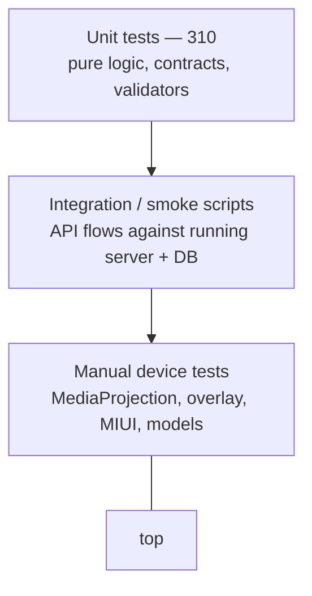

# Testing Strategy — SafeGuard AI Parental Control Platform

**Author:** Helmi Megdiche — ESPRIT (5th-year PFE)
**Repository:** [github.com/Helmi-Megdiche/PFE](https://github.com/Helmi-Megdiche/PFE)
**Document version:** 1.0 (final)
**Verified totals (final):** **310 automated tests** — **181 mobile** (23 suites) + **129 backend** (17 suites), all passing.

---

## Table of Contents

1. [Objectives and Scope](#1-objectives-and-scope)
2. [Test Pyramid and Approach](#2-test-pyramid-and-approach)
3. [Tooling and Environments](#3-tooling-and-environments)
4. [Unit Tests — Mobile](#4-unit-tests--mobile)
5. [Unit Tests — Backend](#5-unit-tests--backend)
6. [Integration / Smoke Tests](#6-integration--smoke-tests)
7. [Manual Device Test Plans](#7-manual-device-test-plans)
8. [Non-Functional Testing](#8-non-functional-testing)
9. [Coverage, Gaps, and Risks](#9-coverage-gaps-and-risks)
10. [How to Run Everything](#10-how-to-run-everything)

---

## 1. Objectives and Scope

The testing strategy targets the parts of SafeGuard most likely to break silently and hardest to inspect visually:

- **Deterministic domain logic** — risk combination, scoring formulas, mission decisions, keyword filtering, capture scheduling. These are pure functions and are exhaustively unit-tested.
- **API contracts** — mission lifecycle, approval, cooldown/resurface, and scoring endpoints, validated by unit tests plus smoke scripts against a running server.
- **Device-only behaviour** — MediaProjection, UsageStats, overlays, and on-device model inference, validated manually because they depend on native permissions and OEM behaviour (MIUI).

Out of scope for automation in v1.0-final: on-device UI end-to-end (no Detox/Appium), and native Java modules (validated manually).

---

## 2. Test Pyramid and Approach



- **Wide unit base (310 tests):** fast (< 10 s per suite), no device, no network. This is the primary regression safety net.
- **Thin integration layer:** PowerShell/TS smoke scripts exercise real HTTP + PostgreSQL for end-to-end confidence.
- **Manual apex:** documented, repeatable device checklists for anything that cannot be faked (permissions, overlays, camera of the screen, OEM quirks).

Testing philosophy: keep business rules in **pure modules** so they are testable and self-documenting, and push side effects (native calls, HTTP, DB) to thin edges.

---

## 3. Tooling and Environments

| Layer | Runner | Config | Notes |
|-------|--------|--------|-------|
| Mobile | Jest 29 (`preset: react-native`) | `MobileApp/package.json` (`jest`), `jest.setup.js` | Native modules and image assets mocked (`__mocks__/`) |
| Backend | Jest 29 (`ts-jest`) | `backend/` Jest config | Pure logic tests avoid live DB; DB-backed paths use fakes/fixtures |
| Smoke | PowerShell + `tsx` | `backend/scripts/*` | Require API on :3000 and a seeded database |
| Combined | PowerShell | `scripts/run-all-tests.ps1` | Runs mobile + backend sequentially |

Environments:

- **Local unit** — no external services; deterministic.
- **Integration** — Docker PostgreSQL (`npm run db:up`), migrated (`npm run db:migrate`), API running (`npm run dev`).
- **Device** — physical Android (API 29+, MIUI recommended for attribution testing) on the same LAN as the backend.

---

## 4. Unit Tests — Mobile

`MobileApp/__tests__/` — **23 suites, 181 tests**.

| Suite | Area under test |
|-------|-----------------|
| `adaptiveCapture.test.ts` | Risk-tier interval selection (10/15/20 s), HIGH ≤ MEDIUM ≤ LOW invariant |
| `appCapturePolicy.test.ts` | App-category interval caps (browser/social ≤ 15 s, game/system 0, education ≥ 120 s) |
| `appSwitchCapture.test.ts` | Immediate + follow-up capture on app switch, debounce |
| `riskCombination.test.ts` | `OCR×0.3 + vision×0.7`, category floors, explicit OCR boost |
| `riskMapping.test.ts` | ML Kit label → category weight mapping |
| `nsfwClassifier.test.ts` | TFLite score interpretation / proxy behaviour |
| `keywordFilter.test.ts`, `keywordFilterMultilingual.test.ts` | EN/FR/AR/Derja matching, normalized channel |
| `normalizeArabizi.test.ts` | Digit-letter Arabizi normalization + gating |
| `cleanOcrText.test.ts` | UI-noise stripping (timestamps, counts, chrome) |
| `arabicOcrTrigger.test.ts` | When to invoke Tesseract `ara` |
| `riskySearchContext.test.ts` | Filtered SERP cap; explicit search-box query bypass (`Q zebi`) |
| `benignRiskContext.test.ts` | Social inbox / benign context filtering |
| `adultSiteContext.test.ts` | Explicit adult site/query handling |
| `launcherCaptureContext.test.ts` | Recents-widget neutralization |
| `inferAppPackageFromOcr.test.ts` | MIUI/SafeGuard package override from OCR |
| `missionPresentationGuard.test.ts` | New-mission / resurface / startup / post-mission grace debounces |
| `missionNotificationLaunch.test.ts` | Notification → mission screen launch |
| `gameLogic.test.ts` | Tic-tac-toe minimax, sudoku, N-back, reaction, Hanoi scoring |
| `devOverlayOcr.test.ts` | Dev overlay OCR handling |
| `imageUri.test.ts` | Content URI handling |
| `jwtUtils.test.ts` | JWT decode + `isJwtExpired` |
| `App.test.tsx` | App renders / smoke |

**Key invariants asserted:** capture interval ordering, quiz pass threshold (≥ 2/3), minimax unbeatability, filtered-SERP cap unless explicit query, and mission debounce windows.

---

## 5. Unit Tests — Backend

`backend/tests/` — **17 suites, 129 tests**.

| Suite | Area under test |
|-------|-----------------|
| `scoringEngine.test.ts` | Addiction (5 components + exposure penalty) and wellbeing (5 components) |
| `wellbeingProxies.test.ts` | Physical/bedtime/family proxies; parent-approval gating |
| `missionGenerator.test.ts` | Adaptive threshold, cumulative burst, category mapping, escalation |
| `missionHelpers.test.ts` | Pending count (excludes `pending_approval`), recent-risky blocking, active pending selection |
| `resurface.test.ts`, `resurfaceCooldown.test.ts` | Cooldown resurface, bump, failed re-open, risky preference |
| `missionCompletion.test.ts` | Completion scoring, escape penalty |
| `missionsApproval.test.ts` | Approve/reject workflow, points on approval |
| `gamificationService.test.ts` | Badge tiers, single age badge, cleanup |
| `quizService.test.ts` | Age-filtered question selection, metadata enrichment |
| `customMissionService.test.ts` | Custom mission CRUD + pool merge |
| `riskMapping.test.ts` | Shared label mapping (parity with mobile) |
| `benignRiskContext.test.ts` | Server-side benign filtering parity |
| `foregroundDetection.test.ts` | Foreground resolution helpers |
| `child.validator.test.ts` | Interests tag validation (Joi) |
| `arabicOcr.test.ts` | Debug Arabic OCR extraction |
| `debugPipeline.test.ts` | Debug classify pipeline (nsfwjs + Tesseract) |

**Key invariants asserted:** exposure penalty cap (+20), adaptive threshold clamp (50–80), cumulative trigger (sum > 300, ≥ 3 events), 3-pending limit semantics, and resurface-not-recreate behaviour during cooldown.

---

## 6. Integration / Smoke Tests

Located in `backend/scripts/`. Require the API on :3000 and a migrated, seeded database.

| Script | Command | Flow validated |
|--------|---------|----------------|
| `smoke-missions.ps1` | `npm run smoke:missions` | Health, dev tokens, generate/list/complete mission, points, badges, reward create + child claim |
| `smoke-sprint58.ts` | `npm run smoke:sprint58` | Interests API, age-based screen caps, mission tie-breaker, wellbeing proxy seeding, daily job, scores/level, approval → physical proxy increment |
| `test-sprint59.ts` | `npm run test:sprint59` | `GET/PUT /api/child/profile`, age-badge re-award, screen-minute caps (120/150/180), ranks source data |

**Caveat (documented):** smoke tests read live DB state; pre-existing missions/events affect counts. Use baseline deltas or a clean database for precise assertions.

---

## 7. Manual Device Test Plans

These require a physical Android device and cannot be automated in v1.0-final. See also `MobileApp/TESTING.md` if present.

### 7.1 Permissions & capture

| # | Step | Expected |
|---|------|----------|
| 1 | Launch app, toggle monitoring | MediaProjection consent dialog appears |
| 2 | Accept consent | Persistent foreground-service notification shows; captures begin |
| 3 | Open Chrome with visible text, wait ~20 s | Backend logs `POST /api/screen-events`; event stored |
| 4 | Revoke MediaProjection | Capture stops cleanly (no crash) |

### 7.2 Foreground attribution (MIUI focus)

| # | Step | Expected |
|---|------|----------|
| 1 | Switch SafeGuard → Messenger | Event `app_package = com.facebook.orca` (not launcher) |
| 2 | Open recents widget with a risky thumbnail | Launcher recents-only capture neutralised |
| 3 | Rapid app switches (< 5 s) | Debounce; frame arrives on follow-up/periodic timer |

### 7.3 Risk detection

| # | Step | Expected |
|---|------|----------|
| 1 | Google search box with explicit query | Not capped; risky event + mission path |
| 2 | Filtered SERP (SafeSearch/Mode IA) with body-only keywords | Capped; no false mission |
| 3 | Adult page (Chrome) | High combined risk; mission generated (subject to cooldown) |

### 7.4 Missions & overlay

| # | Step | Expected |
|---|------|----------|
| 1 | Grant "Display over other apps"; trigger risky content | Overlay appears above the third-party app |
| 2 | Deny overlay permission; trigger risky content | High-priority notification opens in-app mission |
| 3 | Complete a quiz (≥ 2/3) | Points awarded; overlay dismissed |
| 4 | Abandon an active mission (Home) after 3 s | −10 penalty; status `failed` |
| 5 | Complete then stay on risky content | No back-to-back overlay within 10 s grace |

### 7.5 Auth lifecycle

| # | Step | Expected |
|---|------|----------|
| 1 | Expire/clear token, restart | Fresh dev token fetched automatically |
| 2 | Force a 401 | No redbox; token cleared, refresh requested |
| 3 | Profile → "Log out / refresh JWT" | Token cleared; monitoring resumes with new token |

### 7.6 Parent dashboard

| # | Step | Expected |
|---|------|----------|
| 1 | Open `/demo.html`, load child | Scores, level, events, badges render |
| 2 | Approve a pending real-world mission | Points awarded; wellbeing physical proxy increments next cron |
| 3 | Edit interests / birth year | Persisted; age badge re-awarded |

---

## 8. Non-Functional Testing

| Attribute | Method | Acceptance |
|-----------|--------|-----------|
| Privacy | Inspect network payloads; confirm no image bytes leave device on production path | Only text preview (≤ 500) + scores |
| Performance | Metro `[NSFW] TFLite` and pipeline timings; ensure < 25 s budget | English frames fast; Arabic within budget |
| Reliability | Force hung frame; observe watchdog / OCR-lock takeover / foreground self-heal | Pipeline recovers, no permanent stall |
| Security | Call protected route without JWT | 401; `/dev` and `/debug` absent in production |
| Battery | Extended monitoring session | Adaptive intervals reduce capture on low-risk screens |

---

## 9. Coverage, Gaps, and Risks

**Well covered:** scoring, mission generation/cooldown/resurface, risk combination, capture scheduling, keyword/OCR normalization, game logic, JWT expiry, validators.

**Known gaps (honest):**

- No automated UI E2E (Detox/Appium not integrated).
- Native Java modules (`ScreenCaptureModule`, `ForegroundAppModule`, overlay) rely on manual validation.
- Backend DB-integration assertions depend on seed state; smoke scripts are not hermetic.
- On-device model numerics differ from server debug (nsfwjs/Tesseract) — debug scores are **not** production scores.
- No load/soak testing; single-node assumptions untested at scale.

These gaps are consistent with the limitations recorded in [PREFINAL_REPORT.md](PREFINAL_REPORT.md) §4.9.

---

## 10. How to Run Everything

**Mobile unit tests**

```bash
cd MobileApp
npm test
```

**Backend unit tests**

```bash
cd backend
npm test
```

**All unit tests (mobile + backend)**

```powershell
powershell -ExecutionPolicy Bypass -File scripts/run-all-tests.ps1
```

**Smoke / integration (API on :3000, DB migrated)**

```powershell
cd backend
npm run dev            # separate terminal
npm run smoke:missions
npm run smoke:sprint58
npm run test:sprint59
```

**Expected result at final:** mobile `181 passed / 23 suites`, backend `129 passed / 17 suites` (total **310**).

---

*End of testing strategy — SafeGuard v1.0-final.*
